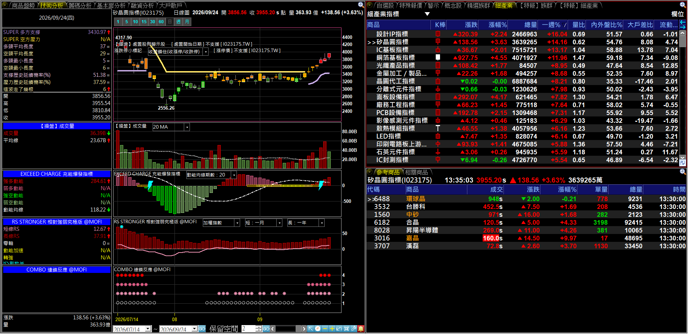
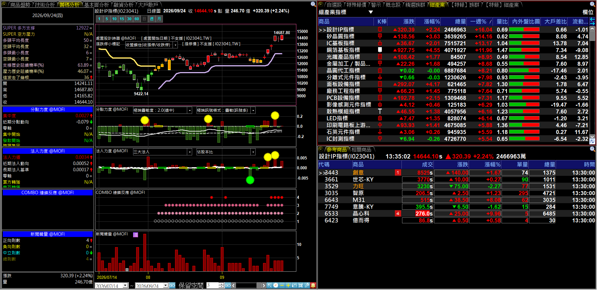

# 老墨的看盤介面 · ZERO SYSTEM PRO MAX

**老墨全指標的一站式看盤版面——匯入一個檔，整套環境直接長出來**

六個頁籤、一次到位：商品盤勢／技術分析／籌碼分析／基本面分析／融資分析／大戶散戶。不用一支一支裝指標、不用自己排版面，匯入即用

 

 

  

[-3DDC84?style=for-the-badge)](https://github.com/mophyfei/MOFI_XQ/raw/main/00.%20%E7%9C%8B%E7%9B%A4%E9%A0%81%E9%9D%A2/ZERO%20SYSTEM%20PRO%20MAX/ZERO%20SYSTEM%20PRO%20MAX%20%28%E8%80%81%E5%A2%A8%E5%84%AA%E6%83%A0%E7%A2%BC%EF%BC%9A%40MOFI%29.daox)

### 🔑 使用前必做：先綁定優惠碼 `@MOFI`

**本版面內含的自訂指標需在 XQ 綁定優惠碼 `@MOFI` 才能解鎖使用**；綁定 `@MOFI` 為 XQ 平台官方推薦活動，可獲 XQ 點數 100 點折抵 👇

---

## 💭 為什麼叫 ZERO SYSTEM

名字來自《新機動戰記鋼彈W》裡飛翼鋼彈零式搭載的**零式系統（ZERO System）**。

它的全名是 **Z**oning and **E**motional **R**ange **O**mitted——「領域化與**情緒排除**系統」。運作方式是把戰場上所有感測器的資料蒐集起來，推演每一種可能的行動與後果，然後直接灌進駕駛員腦中。

原作裡，這套系統是**危險**的。資訊量太大會反噬駕駛員，精神不夠強的人會崩潰——卡特爾就是在悲痛中啟動它，失控摧毀了整個殖民地。所以設定上，一般人扛不住零式系統。

**而這正是散戶每天的處境。**

市場灌給你的資訊量早就過載了：新聞、老師喊單、群組尖叫、帳面數字上下跳。多數人不是缺資訊，是**被資訊反噬**，然後靠情緒做決定——追高、殺低、凹單。

所以這套版面把零式系統反過來用：**不是把更多資訊灌進你腦裡，而是把該看的東西整理好、擺在固定的位置**。趨勢在哪一格、籌碼在哪一格、融資鬆緊在哪一格，每天打開都在同一個地方。

一樣是 Emotional Range Omitted——但排除的不是你的人性，是**你看盤時的情緒雜訊**。

---

## 💡 這是什麼

> **解決的問題：指標裝好了，但版面要自己一格一格排到什麼時候？**

你已經下載了老墨的一堆指標，但每支都要自己開副圖、自己調參數、自己決定放哪一格——排完一個順手的看盤環境，往往比寫指標還久。

**ZERO SYSTEM PRO MAX 是老墨自己每天在用的那個版面**，直接打包成一個檔。匯入之後，六個頁籤、每格該掛什麼指標、參數怎麼設、要對照哪些報價清單，**全部長好**。

 

 
▲ 匯入後未經任何修飾的實際畫面——左邊六個頁籤、右邊常駐報價區，打開就是這樣

### 🎁 `.daox` 自帶腳本，不用另外裝

這是重點：**`.daox` 版面檔本身就內含所有用到的 XScript 腳本**。你匯入版面的同時，裡面的指標會一起帶進來——**不需要再一支一支下載 `.xsb`、不需要一支一支編譯**。

---

## 🗂️ 六個頁籤，六種看法

版面左半邊是**六個頁籤**（切換不同觀測面），右半邊是**常駐報價區**（自選股、精選族群、細產業、特報族群／細產業），左右對照著看。

> 📌 **看圖前先知道**：下面的截圖橫跨個股與產業指數。**掛在產業指數上時，個股專屬欄位（處置狀態、漲跌停價、融資維持率等）會顯示 `N/A` 或「不支援」，這是正常的**——那些資料本來就只有個股才有，換成個股就會有值。財報欄位標「未公佈」則代表該期尚未公告，不是指標故障。

 

### ① 商品盤勢 — 當日盤中怎麼走

分時走勢、流動大戶買賣力、當沖內外盤成交線，盤中即時追蹤資金動向。

 
▲ 分時走勢 ＋ 流動大戶買賣力 ＋【當沖】內外盤成交線

 

### ② 技術分析 — 趨勢、動能、相對強弱一次看

主圖掛 **[SUPER TREND PRO MAX](../../03.%20%E6%8A%80%E8%A1%93%E9%9D%A2%E8%A7%80%E6%B8%AC/SUPER%20TREND%20PRO%20MAX%20%E8%B6%85%E7%B4%9A%E8%B6%A8%E5%8B%A2%E7%89%B9%E5%8C%96%E7%89%88/)**（趨勢支撐壓力）、**處置股與警示股標記**、**漲跌停小標記**；副圖是**成交量**、**[EXCEED CHARGE](../../03.%20%E6%8A%80%E8%A1%93%E9%9D%A2%E8%A7%80%E6%B8%AC/EXCEED%20CHARGE%20%E5%85%85%E8%83%BD%E7%88%86%E7%99%BC%E6%8C%87%E6%A8%99/)**（動能充能）、**[RS STRONGER](../../03.%20%E6%8A%80%E8%A1%93%E9%9D%A2%E8%A7%80%E6%B8%AC/RS%20STRONGER%20%E7%9B%B8%E5%B0%8D%E5%BC%B7%E5%BC%B1%E7%A9%B6%E6%A5%B5%E7%89%88/)**（相對強弱），最下面是 🆕 **[COMBO 連鎖反應](../../03.%20%E6%8A%80%E8%A1%93%E9%9D%A2%E8%A7%80%E6%B8%AC/COMBO%20%E9%80%A3%E9%8E%96%E5%8F%8D%E6%87%89/)**——四支技術指標現在有幾支同時亮燈，疊幾顆點就是亮幾燈。

💡 指標名稱可點擊，進到該支的完整說明頁看參數與用法。

左側欄位的「支撐／壓力歷史延續機率(%)」是**事後統計**——歷史上該支撐或壓力位置被守住的次數佔比，屬對過去資料的計算，非對未來的推估。

 
▲ SUPER TREND 主圖 ＋ 成交量 ＋ EXCEED CHARGE ＋ RS STRONGER ＋ COMBO 副圖

 

### ③ 籌碼分析 — 分點、法人，加上新聞與技術面對照

**[分點力度](../../04.%20%E7%B1%8C%E7%A2%BC%E9%9D%A2%E8%A7%80%E6%B8%AC/%E5%88%86%E9%BB%9E%E5%8A%9B%E5%BA%A6/)**（籌碼集中還是分散）＋ **[法人力度](../../04.%20%E7%B1%8C%E7%A2%BC%E9%9D%A2%E8%A7%80%E6%B8%AC/%E6%B3%95%E4%BA%BA%E5%8A%9B%E5%BA%A6/)**（法人站買方還是賣方），主圖搭配 **[處置警示倒數計時器](../../05.%20%E4%BA%8B%E4%BB%B6%E9%9D%A2%E8%A7%80%E6%B8%AC/%E8%99%95%E7%BD%AE%E8%AD%A6%E7%A4%BA%E5%80%92%E6%95%B8%E8%A8%88%E6%99%82%E5%99%A8/)** 與漲跌停標記。

下方再加兩支 🆕：**[COMBO 連鎖反應](../../03.%20%E6%8A%80%E8%A1%93%E9%9D%A2%E8%A7%80%E6%B8%AC/COMBO%20%E9%80%A3%E9%8E%96%E5%8F%8D%E6%87%89/)**（技術面亮幾燈）與 **[新聞聲量](../../05.%20%E4%BA%8B%E4%BB%B6%E9%9D%A2%E8%A7%80%E6%B8%AC/%E6%96%B0%E8%81%9E%E8%81%B2%E9%87%8F/)**（每天被報導幾則、調性偏正或偏負），籌碼、技術、話題在同一頁對照著看。

 
▲ 分點力度 ＋ 法人力度 ＋ COMBO ＋ 新聞聲量

 

### ④ 基本面分析 — 營收、資本支出、研發費用

三支基本面指標並排：**月營收**、**資本支出**、**研發費用**，直接畫在 K 線下方，跟股價一起看。

⚠️ 這一頁需要「盤後量化選股模組」才會有資料，沒訂閱可以先跳過——其他五個頁籤不受影響。

 
▲ 營收／資本支出／研發費用三段對照

 

### ⑤ 融資分析 — 融資水位與斷頭壓力

**價量累計圖**（套牢區）＋ **斷頭家數統計** ＋ **散戶熱度** ＋ **[大盤融資維持率](../../01.%20%E7%B8%BD%E9%AB%94%E7%92%B0%E5%A2%83%E8%A7%80%E6%B8%AC/%E5%A4%A7%E7%9B%A4%E8%9E%8D%E8%B3%87%E7%B6%AD%E6%8C%81%E7%8E%87/)**，看融資結構是鬆是緊。

這一頁是跨觀測面的組合——斷頭家數與散戶熱度歸在籌碼面、大盤融資維持率歸在環境面，放同一頁是為了對照著看。

 
▲ 價量累計圖 ＋ 斷頭家數統計 ＋ 散戶熱度 ＋ 大盤融資維持率

 

### ⑥ 大戶散戶 — 籌碼在誰手上

**大戶持股比例**、**散戶持股比例**、**大戶散戶自動調整持股**三段並列，一眼看籌碼往哪邊移動。

 
▲ 大戶持股／散戶持股／自動調整門檻持股

---

## 📡 右側常駐報價區：這裡藏了兩個省時間的設計

不管切到哪個頁籤，右半邊的報價區都在。除了看排行，它真正好用的是**上下連動**——上面點什麼，下面就自動帶出對應的東西，不用另外開視窗查。

 

### 🔗 亮點一：想知道一個產業有哪些成分股？點一下就有

以前要知道「銅箔基板這個產業到底包含哪些股票」，得自己一檔一檔查、或去翻資料。

**在這裡，上面點一個產業，下面的「參考商品」就自動列出它的成分股。**

 
▲ 上方點選細產業（例：LCD 驅動 IC 指標），下方「參考商品」立刻列出該產業的成分股

 

### 🔗 亮點二：想找同一檔的衍生商品？切到「相關商品」就有

看現貨想做期貨、看現貨想找可轉債或權證——以前得自己去搜代號。

**「相關商品」這個頁籤，會把同一檔標的的所有衍生商品一次列出來**：期貨近月、小型期、可轉債、各家券商的權證，全部帶出來。

 
▲ 選定一檔標的後切到「相關商品」，期貨近月、小型期、可轉債、各家權證一次到齊

 

### 📊 還有：十餘種排行，下拉即換

<table>
<tr>
<td width="50%" valign="top" align="center">

**【特報】大戶買超排行**

當日／流動大戶買超金額前 50 名。

</td>
<td width="50%" valign="top" align="center">

**【特報】大戶賣超排行**

同一個下拉選單切換，賣超方向一併掌握。

</td>
</tr>
</table>

強勢／弱勢族群、當日與流動大戶買賣超、買賣超比、量比排行、昨日強弱勢、前 5 日漲幅前 50 名⋯⋯同一個面板切換。

---

## 🪜 怎麼用

### ① 綁定優惠碼 `@MOFI`

先在 XQ 綁定 **`@MOFI`**，版面內的自訂指標才能解鎖。

### ② 下載 `.daox` 版面檔

點上方的 [⬇️ 下載看盤版面](https://github.com/mophyfei/MOFI_XQ/raw/main/00.%20%E7%9C%8B%E7%9B%A4%E9%A0%81%E9%9D%A2/ZERO%20SYSTEM%20PRO%20MAX/ZERO%20SYSTEM%20PRO%20MAX%20%28%E8%80%81%E5%A2%A8%E5%84%AA%E6%83%A0%E7%A2%BC%EF%BC%9A%40MOFI%29.daox)。

### ③ 在 XQ 開啟版面

開啟 XQ →「**檔案**」→「**開啟舊檔**」→ 選下載好的 `.daox` → 版面連同裡面的指標一起載入。

> 💡 `.daox` 是 XQ 的**版面檔**，跟單支指標的 `.xsb` 不同——它記錄整個工作區的配置，而且**自帶所用到的腳本**，所以不必再用一鍵匯入工具逐支匯入。

### ④ 換成你要看的股票

版面載入後，把商品換成你自己要觀察的標的，六個頁籤會一起跟著更新。

---

## 🧩 需要的 XQ 模組

不用全部都買。依重要性分成三級：

| 模組 | 建議 | 為什麼 |
|------|:---:|------|
| **盤中量化交易模組** $1,000/月 | ✅ **必備** | 自訂指標／XScript 都靠這個模組。沒有它，版面裡老墨寫的指標全部跑不出來 |
| **籌碼模組** $500/月 | 🔥 **強烈推薦** | 解鎖**族群與成分股**的籌碼資料——分點力度、法人力度才能掛在產業類股指數上、透視整個族群。這是這套版面最有價值的用法 |
| **盤後量化選股模組** $1,000/月 | 🔸 **選配** | 只有「基本面分析」頁籤（營收／資本支出／研發費用）會用到。以後老墨分享選股策略時也會需要，其他時候用不上 |

> 💡 白話版：**先買盤中**（不然什麼都看不到）→ **再加籌碼**（族群透視是精華）→ **盤後看你要不要做基本面跟選股策略**。手機僅限監控訊號，完整功能需電腦版。[XQ 模組比較](https://www.xq.com.tw/module-compare/)。

---

## 📌 使用須知

- 🔑 需在 XQ 綁定優惠碼 **`@MOFI`** 才能解鎖版面內的自訂指標
- 📐 本版面為老墨個人看盤配置，參數與組合僅為個人使用習慣
- 🖥️ 版面在不同螢幕解析度下的排列可能略有差異，可自行調整各區塊大小

---

## 🆕 更新紀錄

### 2026/09/25

版面加入兩支新指標，`.daox` 已重新匯出：

- **技術分析頁籤**：新增成交量與 [COMBO 連鎖反應](../../03.%20%E6%8A%80%E8%A1%93%E9%9D%A2%E8%A7%80%E6%B8%AC/COMBO%20%E9%80%A3%E9%8E%96%E5%8F%8D%E6%87%89/)
- **籌碼分析頁籤**：新增 COMBO 連鎖反應與 [新聞聲量](../../05.%20%E4%BA%8B%E4%BB%B6%E9%9D%A2%E8%A7%80%E6%B8%AC/%E6%96%B0%E8%81%9E%E8%81%B2%E9%87%8F/)

> 💡 已經匯入過舊版版面的朋友，**重新下載 `.daox` 並開啟**即可拿到新指標，下載連結沒有變。

### 2026/08/05

版面內含的 **SUPER TREND PRO MAX** 指標有更新，`.daox` 已一併重新匯出：

- **修正**：掛在「還原日線圖」時趨勢線與 K 棒錯位。
- **修正**：趨勢持續根數在盤中會隨每筆成交虛增，連帶影響平均長度與歷史延續機率。
- **新增**：`這波走了幾根`、`這波長度超過歷史幾成` 兩個數值。

細節見 [SUPER TREND PRO MAX 說明頁](../../03.%20%E6%8A%80%E8%A1%93%E9%9D%A2%E8%A7%80%E6%B8%AC/SUPER%20TREND%20PRO%20MAX%20%E8%B6%85%E7%B4%9A%E8%B6%A8%E5%8B%A2%E7%89%B9%E5%8C%96%E7%89%88/README.md)。

> 💡 已經匯入過舊版版面的朋友，**重新下載 `.daox` 並開啟**即可拿到更新後的指標，下載連結沒有變。

---

## ⚠️ 免責聲明與利益揭露

**📣 利益揭露**
綁定優惠碼 `@MOFI` 為 XQ 平台官方推薦活動；老墨將因您綁定取得平台回饋，屬商業合作關係。

**工具性質**
本版面及其所含之全部腳本，皆為中性技術分析輔助工具，功能為將公開市場資料視覺化呈現。所有數值均為對公開資料之客觀統計，不構成任何買賣建議、不對後續走勢作出研判、不保證獲利。

**非投顧事業**
老墨非經主管機關核准之證券投資顧問事業。本頁面全部內容不構成投資推介、分析意見或任何形式之投資顧問服務。

**關於本頁截圖**
本頁所有畫面截圖中出現之商品代號、名稱、報價與數值，均僅為版面功能之示範，非推介標的，不代表老墨持有該等商品或建議買賣。

**歷史數據之限制**
所有統計數值均為對過去資料之計算，歷史表現不代表未來結果。程式邏輯與資料來源均可能存在誤差。

**風險自負**
本版面及腳本僅供技術研究與教學用途。任何投資決策應由使用者依自身判斷為之，所生盈虧由使用者自行承擔。

**智慧財產權**
《新機動戰記鋼彈W》及「零式系統」相關設定之著作權與商標權屬原權利人（創通／SUNRISE／BANDAI）所有。本頁「為什麼叫 ZERO SYSTEM」一節僅為說明命名靈感之評論性引用，本工具與上述權利人並無任何關聯，亦未獲其授權或背書。

---

[← 回到腳本庫首頁](../../README.md) ·  老墨 XQ 腳本庫 · 解鎖優惠碼 `@MOFI`

