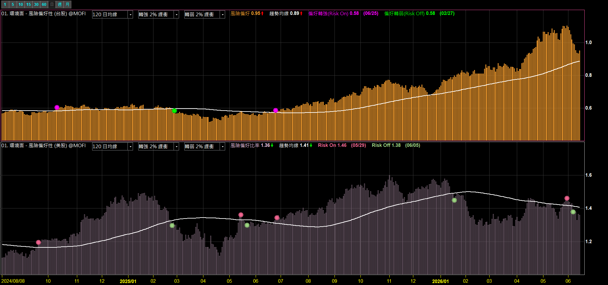
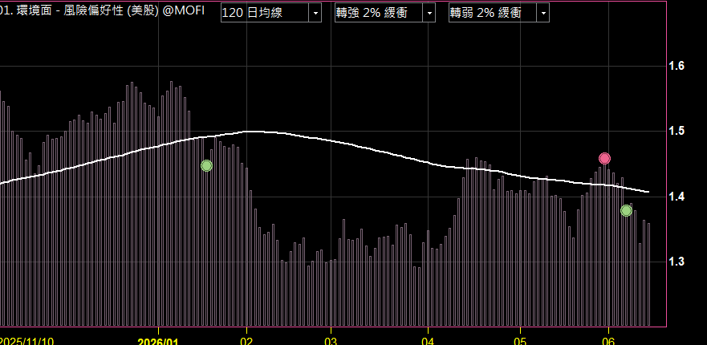
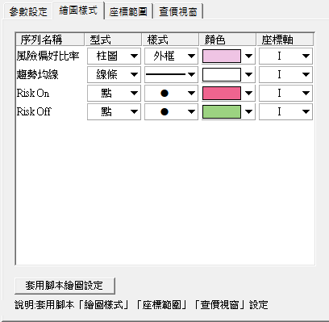

# 風險偏好性指標（台股 × 美股）

**用「攻擊類 / 防守類」資產比率，一眼判讀市場是 Risk On 還是 Risk Off**

資金往攻擊型跑＝偏好風險；往防守型跑＝避險情緒升溫。台股看電金比、美股看 XLY/XLP，附懶人包看盤頁面

 

 

  

[-3DDC84?style=for-the-badge)](https://github.com/mophyfei/MOFI_XQ/raw/main/01.%20%E7%B8%BD%E9%AB%94%E7%92%B0%E5%A2%83%E8%A7%80%E6%B8%AC/%E9%A2%A8%E9%9A%AA%E5%81%8F%E5%A5%BD%E6%80%A7/01.%20%E7%92%B0%E5%A2%83%E9%9D%A2%20-%20%E9%A2%A8%E9%9A%AA%E5%81%8F%E5%A5%BD%E6%80%A7%20%28%E8%80%81%E5%A2%A8%E5%84%AA%E6%83%A0%E7%A2%BC%EF%BC%9A%40MOFI%29.xsb)
&nbsp;
[-9333EA?style=for-the-badge)](https://github.com/mophyfei/MOFI_XQ/raw/main/01.%20%E7%B8%BD%E9%AB%94%E7%92%B0%E5%A2%83%E8%A7%80%E6%B8%AC/%E9%A2%A8%E9%9A%AA%E5%81%8F%E5%A5%BD%E6%80%A7/01.%20%E7%92%B0%E5%A2%83%E9%9D%A2%20-%20%E8%B3%87%E9%87%91%E9%A2%A8%E9%9A%AA%E5%81%8F%E5%A5%BD%E7%9C%8B%E7%9B%A4%E9%A0%81%E9%9D%A2%20%28%E8%80%81%E5%A2%A8%E5%84%AA%E6%83%A0%E7%A2%BC%EF%BC%9A%40MOFI%29.daox)

或用 <a href="https://github.com/mophyfei/MOFI_XQ/releases/latest/download/XQ-Script-Importer.exe">🚀 一鍵匯入工具</a> 匯入指標

### 🔑 使用前必做：先綁定優惠碼 `@MOFI`

**本腳本需在 XQ 綁定優惠碼 `@MOFI` 才能解鎖使用**；綁定 `@MOFI` 為 XQ 平台官方推薦活動，可獲 XQ 點數 100 點折抵 👇

📣 **利益揭露**：綁定 `@MOFI` 為 XQ 平台官方推薦活動；老墨將因您綁定取得平台回饋（屬商業合作關係）。

> ⚠️ **使用前必讀**：本工具為**中性技術分析輔助工具**，僅將公開指數比率視覺化以呈現市場風險情緒，**不提供任何個股買賣建議、不保證獲利**。老墨**非**經主管機關核准之證券投資顧問事業，本內容不構成投資推介。**歷史數據不代表未來表現**，投資決策與盈虧由使用者自行負責。

---

## 💡 這是什麼

> **解決的問題：市場資金在衝還是在縮。**

市場資金在「**攻擊型**」與「**防守型**」資產之間的流向，反映整體**風險偏好（Risk On / Off）**。本指標把這個比率畫出來，並標記轉強／轉弱：

- **台股版**：電子(TSE23) / 金融(TSE28) 比率 — 電子轉強＝資金偏攻擊，金融轉強＝偏防守
- **美股版**：XLY(非必需消費) / XLP(必需消費) 比率 — 經典 Risk On / Off 觀察指標
- 比率對照**趨勢均線**，突破上緩衝＝**偏好轉強(Risk On)**、跌破下緩衝＝**偏好轉弱(Risk Off)**
- **訊號過濾**：同方向只標記第一次，避免連續訊號干擾

用來判讀**大盤層級的資金情緒環境**（屬總經/環境觀測，非個股研判）。

---

## 📦 你會得到什麼

| 下載 | 內容 |
|------|------|
| **指標 `.xsb`** | 匯入後自動得到**兩個指標**：`風險偏好性(台股)`、`風險偏好性(美股)` |
| **看盤頁面 `.daox`** | 懶人包：已排好版的台股＋美股風險偏好看盤頁，**匯入即用、免自己設定** |

---

## 🪜 怎麼用

### 方式 A — 懶人包看盤頁面（最簡單）✅
1. [下載看盤頁面 `.daox`](https://github.com/mophyfei/MOFI_XQ/raw/main/01.%20%E7%B8%BD%E9%AB%94%E7%92%B0%E5%A2%83%E8%A7%80%E6%B8%AC/%E9%A2%A8%E9%9A%AA%E5%81%8F%E5%A5%BD%E6%80%A7/01.%20%E7%92%B0%E5%A2%83%E9%9D%A2%20-%20%E8%B3%87%E9%87%91%E9%A2%A8%E9%9A%AA%E5%81%8F%E5%A5%BD%E7%9C%8B%E7%9B%A4%E9%A0%81%E9%9D%A2%20%28%E8%80%81%E5%A2%A8%E5%84%AA%E6%83%A0%E7%A2%BC%EF%BC%9A%40MOFI%29.daox)
2. XQ → 匯入頁面 → 直接得到設定好的看盤頁（如上方封面）

### 方式 B — 自行套用指標
1. [下載指標 `.xsb`](https://github.com/mophyfei/MOFI_XQ/raw/main/01.%20%E7%B8%BD%E9%AB%94%E7%92%B0%E5%A2%83%E8%A7%80%E6%B8%AC/%E9%A2%A8%E9%9A%AA%E5%81%8F%E5%A5%BD%E6%80%A7/01.%20%E7%92%B0%E5%A2%83%E9%9D%A2%20-%20%E9%A2%A8%E9%9A%AA%E5%81%8F%E5%A5%BD%E6%80%A7%20%28%E8%80%81%E5%A2%A8%E5%84%AA%E6%83%A0%E7%A2%BC%EF%BC%9A%40MOFI%29.xsb) 或用 [🚀 一鍵匯入工具](https://github.com/mophyfei/MOFI_XQ/releases/latest/download/XQ-Script-Importer.exe)
2. 按 <kbd>F6</kbd> 編譯後 → **加入指標** → 把「風險偏好性(台股)」「(美股)」分別加到副圖

> 💡 台股版需有電金類指數報價、美股版需有 XLY/XLP 報價權限。

---

## 📊 怎麼判讀

- **比率線在趨勢均線上方並持續走高** → 資金偏好風險（Risk On）
- **比率線跌破均線下緩衝** → 避險情緒升溫（Risk Off）
- **粉紅點 = 偏好轉強(Risk On)**、**綠點 = 偏好轉弱(Risk Off)**：為比率穿越緩衝門檻的標記，同方向只標第一次（僅為情緒狀態標記，非進出場依據）
- 數值欄會列出當前比率、趨勢均線值，與最近一次 Risk On / Risk Off 的日期

> 🔸 **重要**：圖上的粉紅點／綠點與日期，僅是**比率穿越均線緩衝的數學標記**，**並非買進／賣出訊號，也不是進出場時點建議**。

> 📌 圖例為指數比率示範，**僅呈現市場情緒之客觀數據，非個股推介或買賣建議**；示意圖訊號標記非買賣建議。

---

## ⚙️ 參數說明

| 參數 | 說明 | 預設值 | 可選 |
|------|------|--------|------|
| 趨勢均線期數 | 比率的均線基準，越大越長線 | 20 日 | 20 / 60 / 120 / 240 日 |
| 轉強緩衝(%) | 突破均線多少 % 才確認轉強(Risk On) | 2% | 0 / 1 / 2 / 3 / 5 |
| 轉弱緩衝(%) | 跌破均線多少 % 才確認轉弱(Risk Off) | 2% | 0 / 1 / 2 / 3 / 5 |

**建議繪圖樣式**（匯入已自帶；手動調整可參考，以美股版為例，台股版類同）：

| 序列 | 型式 | 顏色 |
|------|------|------|
| 風險偏好比率 | 柱圖（外框） | 粉紅 |
| 趨勢均線 | 線條 | 白 |
| Risk On | 點 | 粉紅 |
| Risk Off | 點 | 綠 |

---

## 🧩 需要的 XQ 模組

本腳本為**自訂 XScript 指標**，需訂閱：

| 模組 | 解鎖 | 本腳本 |
|------|------|:---:|
| **盤中量化交易模組** $1,000/月 | 自訂指標／XScript、警示、回溯、自動交易 | ✅ 必要 |
| **美股分析模組** $500/月 | 美股報價與 XS 美股欄位（XLY／XLP） | 🔸 用**美股版**才需要 |

> 💡 自訂指標屬「盤中量化交易模組」；台股版用台股報價即可，**美股版另需「美股分析模組」**。手機僅限監控訊號，完整功能需電腦版。[XQ 模組比較](https://www.xq.com.tw/module-compare/)。

---

## ⚠️ 注意事項與免責聲明

- 🔑 需在 XQ 綁定優惠碼 **`@MOFI`** 才能解鎖使用
- 📣 **利益揭露**：綁定 `@MOFI` 為 XQ 平台官方推薦活動；老墨將因您綁定取得平台回饋（屬商業合作關係）
- 本工具為**中性技術分析輔助工具**，所有數值皆為**公開指數之歷史/即時數據**，反映市場情緒，**不代表未來、不構成買賣建議、不保證獲利**
- 老墨**非**經主管機關核准之證券投資顧問事業；本內容不構成投資推介或分析意見
- 所有腳本僅供技術研究與教學用途；投資決策與盈虧由使用者自行負責

---

[← 回到腳本庫首頁](../../README.md) ·  老墨 XQ 腳本庫 · 解鎖優惠碼 `@MOFI`

