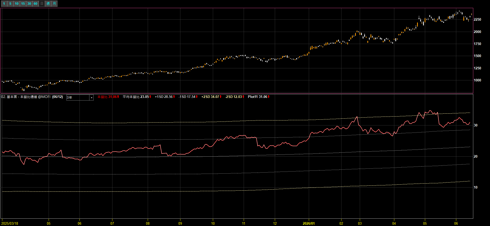
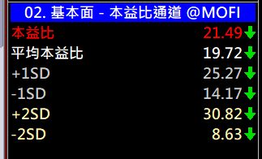
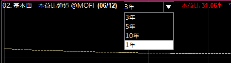

# 本益比通道（PE 標準差通道）

**看本益比落在「自身歷史」的相對高低位置**

以過去 N 年的平均本益比為中軌，畫出 ±1SD / ±2SD 通道，一眼看出目前估值在歷史區間的相對位置。台股、美股皆可

 

 

⚠️ 示意圖，僅為功能示範，非個股推介或估值評等

  

[-3DDC84?style=for-the-badge)](https://github.com/mophyfei/MOFI_XQ/raw/main/02.%20%E5%9F%BA%E6%9C%AC%E9%9D%A2%E8%A7%80%E6%B8%AC/%E6%9C%AC%E7%9B%8A%E6%AF%94%E9%80%9A%E9%81%93/02.%20%E5%9F%BA%E6%9C%AC%E9%9D%A2%20-%20%E6%9C%AC%E7%9B%8A%E6%AF%94%20%E9%80%9A%E9%81%93%20%28%E8%80%81%E5%A2%A8%E5%84%AA%E6%83%A0%E7%A2%BC%EF%BC%9A%40MOFI%29.xsb)
&nbsp;

### 🔑 使用前必做：先綁定優惠碼 `@MOFI`

**本腳本需在 XQ 綁定優惠碼 `@MOFI` 才能解鎖使用**；綁定 `@MOFI` 為 XQ 平台官方推薦活動，可獲 XQ 點數 100 點折抵 👇

📣 **利益揭露**：綁定 `@MOFI` 為 XQ 平台官方推薦活動；老墨將因您綁定取得平台回饋（屬商業合作關係）。

> ⚠️ **使用前必讀**：本工具為**中性技術分析輔助工具**，僅將本益比與其歷史統計區間視覺化，**不提供任何個股買賣建議、不對個股做估值評等**。老墨**非**經主管機關核准之證券投資顧問事業，本內容不構成投資推介。**歷史數據不代表未來表現**，投資決策與盈虧由使用者自行負責。

---

## 💡 這是什麼

單看「本益比 20 倍」其實看不出貴或便宜——要對照**這檔自己的歷史區間**才有意義。本指標以過去 N 年的本益比資料，計算：

- **平均本益比**（中軌）
- **±1SD / ±2SD 標準差通道**（上下軌）

把目前本益比畫在通道裡，一眼看出它落在**自身歷史的相對高位或低位**：

- 本益比靠近 **+2SD** → 處於歷史**相對高位**的本益比區間
- 本益比靠近 **−2SD** → 處於歷史**相對低位**的本益比區間

> 這是估值的**統計位置描述**，不是買賣或估值評等建議；本益比高低受獲利、產業循環等因素影響，需自行綜合判讀。

---

## 🪜 怎麼用

1. **匯入指標** — 用 [🚀 一鍵匯入工具](https://github.com/mophyfei/MOFI_XQ/releases/latest/download/XQ-Script-Importer.exe) 匯入，或手動匯入後按 <kbd>F6</kbd> 編譯。
2. **加到技術分析圖** — **加入指標** → 套用到個股 K 線圖（顯示於副圖）。
3. **選計算年數** — 上方下拉切換回溯年數（1／3／5／10 年），通道會依該期間重算。

> 💡 本指標需標的有「本益比」資料（個股適用；指數本益比視 XQ 資料而定）。

---

## 📊 數值欄說明

| 數值 | 意思 |
|------|------|
| **本益比** | 目前本益比 |
| **平均本益比** | 過去 N 年本益比的平均（通道中軌） |
| **+1SD / −1SD** | 平均 ±1 個標準差 |
| **+2SD / −2SD** | 平均 ±2 個標準差（歷史相對極端區間） |

> 📌 圖例為功能示範，**僅呈現本益比之客觀統計，非個股推介或估值評等**。

---

## ⚙️ 參數說明

| 參數 | 說明 | 預設值 | 可選 |
|------|------|--------|------|
| 計算年數 | 回溯幾年計算平均與標準差 | 3 年 | 1 / 3 / 5 / 10 年 |
| 系統載入筆數 | 需載入的歷史 K 棒數量 | 2500 | 視回溯年數調整 |

> 💡 回溯年數越長，通道越能反映長期估值區間；越短則越貼近近期。

---

## ⚠️ 注意事項與免責聲明

- 🔑 需在 XQ 綁定優惠碼 **`@MOFI`** 才能解鎖使用
- 📣 **利益揭露**：綁定 `@MOFI` 為 XQ 平台官方推薦活動；老墨將因您綁定取得平台回饋（屬商業合作關係）
- 本工具為**中性技術分析輔助工具**，所有數值皆為**本益比之歷史統計**，反映過去估值區間，**不代表未來、不構成買賣建議、不對個股做估值評等、不保證獲利**
- 老墨**非**經主管機關核准之證券投資顧問事業；本內容不構成投資推介或分析意見
- 所有腳本僅供技術研究與教學用途；投資決策與盈虧由使用者自行負責

---

[← 回到腳本庫首頁](../../README.md) ·  老墨 XQ 腳本庫 · 解鎖優惠碼 `@MOFI`

