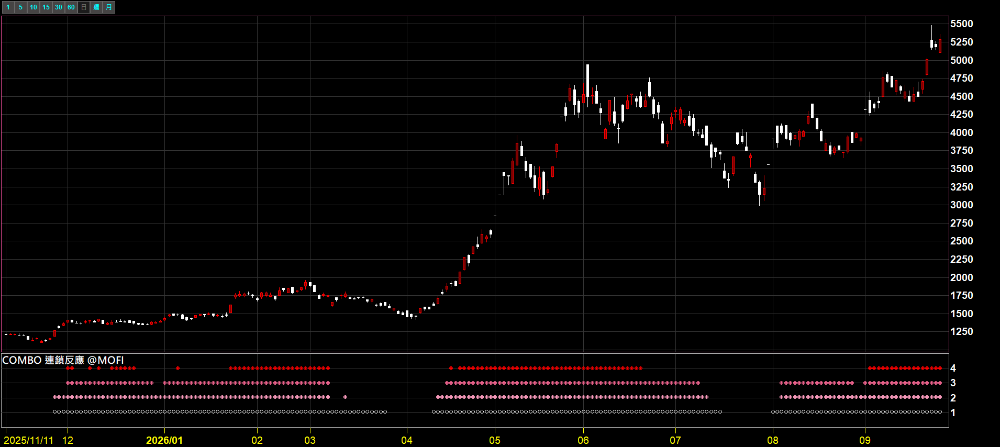
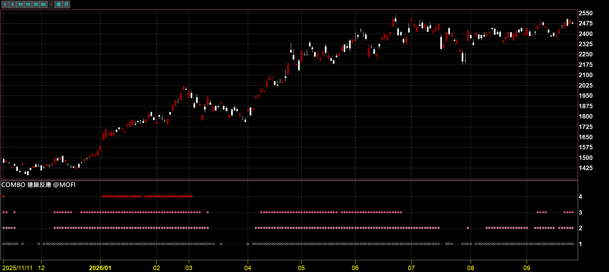
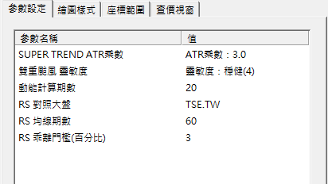
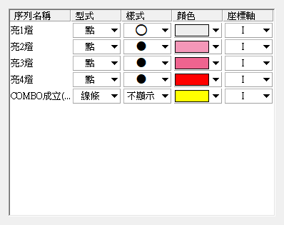

# COMBO 連鎖反應

**四支技術指標，現在有幾支同時亮燈？一排點數給你答案**

把 SUPER TREND、EXCEED CHARGE、雙重颱風、RS STRONGER 四支指標的狀態，收成副圖上由下往上疊的點——亮幾燈、疊幾顆，不用四張圖來回切

 

-4C8BF5?style=flat-square)

 

  

[-3DDC84?style=for-the-badge)](https://github.com/mophyfei/MOFI_XQ/raw/main/03.%20%E6%8A%80%E8%A1%93%E9%9D%A2%E8%A7%80%E6%B8%AC/COMBO%20%E9%80%A3%E9%8E%96%E5%8F%8D%E6%87%89/03.%20%E6%8A%80%E8%A1%93%E9%9D%A2%20-%20COMBO%20%E9%80%A3%E9%8E%96%E5%8F%8D%E6%87%89%20%28%E8%80%81%E5%A2%A8%E5%84%AA%E6%83%A0%E7%A2%BC%EF%BC%9A%40MOFI%29.xsb)
&nbsp;

### 🔑 使用前必做：先綁定優惠碼 `@MOFI`

**本腳本需在 XQ 綁定優惠碼 `@MOFI` 才能解鎖使用**；綁定 `@MOFI` 為 XQ 平台官方推薦活動，可獲 XQ 點數 100 點折抵 👇

---

## 💭 為什麼叫 COMBO

名字來自《假面騎士 OOO》。主角把三枚核心硬幣一枚一枚投進腰帶，湊滿一整套，才發動「COMBO」變身。

這支指標也是同一個概念：**每支指標亮燈，就像投進一枚硬幣**。一枚不稀奇，湊得越多、畫面上疊得越高。

---

## 💡 這是什麼

> **解決的問題：四支指標各看各的，到底現在有幾支同時亮？**

裝了老墨的技術面指標之後，常見的狀況是：趨勢線看一張、動能看一張、相對強弱再看一張，四個副圖來回切，最後腦中還要自己加總一次。

**COMBO 把這個加總直接做好。** 它追蹤下面四支指標各自的狀態，每支亮燈算一顆，在副圖上**從 1 開始由下往上疊點**：

| 指標 | 看的面向 |
|---|---|
| [SUPER TREND PRO MAX](../SUPER%20TREND%20PRO%20MAX%20%E8%B6%85%E7%B4%9A%E8%B6%A8%E5%8B%A2%E7%89%B9%E5%8C%96%E7%89%88/) | 趨勢方向 |
| [EXCEED CHARGE](../EXCEED%20CHARGE%20%E5%85%85%E8%83%BD%E7%88%86%E7%99%BC%E6%8C%87%E6%A8%99/) | 動能 |
| [雙重颱風 K 線](../DOUBLE%20TYPHOON%20%E9%9B%99%E9%87%8D%E9%A2%B1%E9%A2%A8%20K%20%E7%B7%9A/) | K 棒強弱狀態 |
| [RS STRONGER](../RS%20STRONGER%20%E7%9B%B8%E5%B0%8D%E5%BC%B7%E5%BC%B1%E7%A9%B6%E6%A5%B5%E7%89%88/) | 相對大盤的強弱 |

💡 指標名稱可點擊，進到該支的完整說明頁。COMBO 本身不需要另外裝這四支，計算都已經包在腳本裡。

---

## 🪜 怎麼看

### ① 數點：疊到幾，就是亮幾燈

 
▲ 副圖的 1、2、3、4 四層：只有 1 有點＝亮 1 燈；1 到 4 都有點＝四支同時亮燈

 

| 副圖上看到 | 代表 |
|---|---|
| 只有第 1 層有點 | 四支裡有 1 支亮燈 |
| 疊到第 2 層 | 有 2 支同時亮燈 |
| 疊到第 3 層 | 有 3 支同時亮燈 |
| 疊到第 4 層 | 四支全部亮燈 |
| 整段空白 | 四支都沒亮 |

 

### ② 看疊高、也看退場

點數不只看「現在幾顆」，**連續一段怎麼變化**更有資訊量：從 1 慢慢疊上 4、在 3～4 之間維持、或是從 4 一路退回 1，都是四支指標狀態一起變化的過程。

 
▲ 另一段走勢：點數在 2～4 層之間進出，對照上方 K 線看四支指標何時一起亮、何時各自退場

---

## ⚙️ 參數

 

| 參數 | 說明 |
|---|---|
| SUPER TREND ATR 乘數 | 趨勢燈的敏感度，下拉可選 1.5／2.0／3.0／4.0 |
| 雙重颱風 靈敏度 | K 棒強弱燈的敏感度，下拉可選「穩健」或「靈敏」 |
| 動能計算期數 | 動能燈的計算天數 |
| RS 對照大盤 | 相對強弱要跟哪個指數比，預設加權指數 `TSE.TW` |
| RS 均線期數 | 相對強弱燈的觀察天數 |
| RS 乖離門檻（百分比） | 相對強弱要超過多少才算亮燈 |

預設值為老墨個人使用習慣，可依自己的交易週期調整。

---

## 🎨 樣式設定（建議照這樣設）

XScript 沒辦法在腳本裡指定「畫成點」，**匯入後請到指標屬性的「繪圖樣式」手動設定一次**：

 

- **亮1燈～亮4燈**：型式選「點」，顏色由淺到深（老墨用白 → 淺粉 → 粉紅 → 紅）
- **第 5 條序列**：這條是「亮 3 燈以上」的標記線，老墨設成「不顯示」，想看再打開

---

## 🧩 需要的 XQ 模組

| 模組 | 需要嗎 | 為什麼 |
|------|:---:|------|
| **盤中量化交易模組** $1,000/月 | ✅ **必備** | 自訂指標／XScript 都靠這個模組 |

只用到價格與加權指數收盤，不需要其他模組。手機僅限監控訊號，完整功能需電腦版。[XQ 模組比較](https://www.xq.com.tw/module-compare/)

---

## 🪛 怎麼裝

### 方式 A：一鍵匯入工具（最簡單）

用 [🚀 一鍵匯入工具](https://github.com/mophyfei/MOFI_XQ/releases/latest/download/XQ-Script-Importer.exe) 匯入最快。

### 方式 B：手動匯入

開啟 XQ →「**策略**」→ **XScript 編輯器** → 點「**匯入**」→ 選下載好的 `.xsb` → 按 <kbd>F6</kbd> 編譯。

---

## 📌 使用須知

- 🔑 需在 XQ 綁定優惠碼 **`@MOFI`** 才能解鎖
- 📅 **限日線圖使用**：相對強弱固定抓大盤的「日」收盤，掛在分鐘線或週線上會對不齊
- ⏳ 剛上市、歷史資料不足的商品，前面一段不會出點，這是暖身期、屬正常現象
- 📐 參數預設值為老墨個人使用習慣

---

## ⚠️ 免責聲明與利益揭露

**📣 利益揭露**
綁定優惠碼 `@MOFI` 為 XQ 平台官方推薦活動；老墨將因您綁定取得平台回饋，屬商業合作關係。

**工具性質**
本腳本為中性技術分析輔助工具，功能為將公開市場資料視覺化呈現。亮燈數量僅為四支指標狀態的加總，不構成任何買賣建議、不對後續走勢作出研判、不保證獲利。

**非投顧事業**
老墨非經主管機關核准之證券投資顧問事業。本頁面全部內容不構成投資推介、分析意見或任何形式之投資顧問服務。

**關於本頁截圖**
本頁所有畫面截圖中出現之商品、報價與數值，均僅為功能示範，非推介標的，不代表老墨持有該等商品或建議買賣。

**歷史數據之限制**
所有數值均為對過去資料之計算，歷史表現不代表未來結果。程式邏輯與資料來源均可能存在誤差。

**風險自負**
本腳本僅供技術研究與教學用途。任何投資決策應由使用者依自身判斷為之，所生盈虧由使用者自行承擔。

**智慧財產權**
《假面騎士 OOO》相關設定之著作權與商標權屬原權利人（石森プロ／東映）所有。本頁「為什麼叫 COMBO」一節僅為說明命名靈感之評論性引用，本工具與上述權利人並無任何關聯，亦未獲其授權或背書。

---

[← 回到腳本庫首頁](../../README.md) ·  老墨 XQ 腳本庫 · 解鎖優惠碼 `@MOFI`

