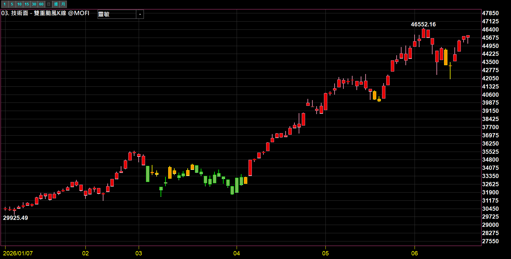
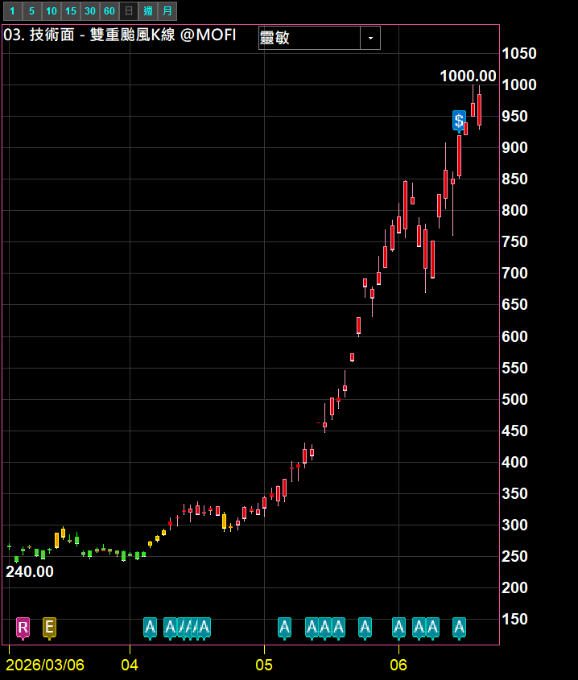
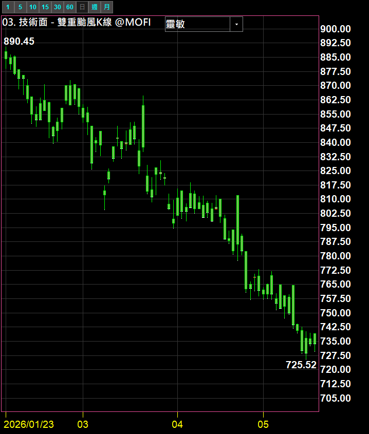
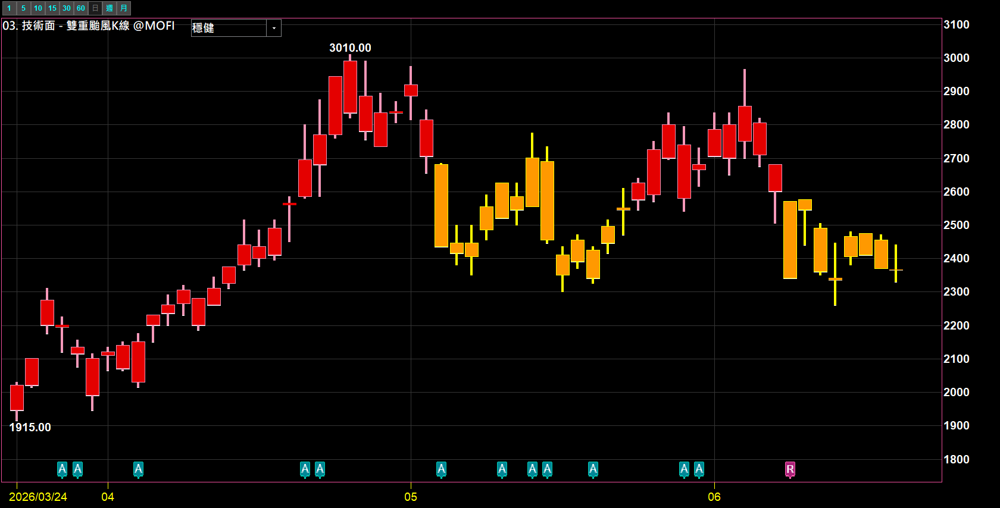

# 雙重颱風 K 線

**把 K 棒依「市場偏多／偏空／不明」自動染成三種顏色的趨勢狀態指標**

不用再自己畫線判斷——一眼看顏色，就知道現在這檔（或大盤）站在多方、空方、還是渾沌不明

 

 

  

[-3DDC84?style=for-the-badge)](https://github.com/mophyfei/MOFI_XQ/raw/main/03.%20%E6%8A%80%E8%A1%93%E9%9D%A2%E8%A7%80%E6%B8%AC/DOUBLE%20TYPHOON%20%E9%9B%99%E9%87%8D%E9%A2%B1%E9%A2%A8%20K%20%E7%B7%9A/03.%20%E6%8A%80%E8%A1%93%E9%9D%A2%20-%20%E9%9B%99%E9%87%8D%E9%A2%B1%E9%A2%A8%20K%20%E7%B7%9A%20%28%E8%80%81%E5%A2%A8%E5%84%AA%E6%83%A0%E7%A2%BC%EF%BC%9A%40MOFI%29.xsb)
&nbsp;

### 🔑 使用前必做：先綁定優惠碼 `@MOFI`

**本腳本需在 XQ 綁定優惠碼 `@MOFI` 才能解鎖使用**；綁定 `@MOFI` 為 XQ 平台官方推薦活動，可獲 XQ 點數 100 點折抵 👇

📣 **利益揭露**：綁定 `@MOFI` 為 XQ 平台官方推薦活動；老墨將因您綁定取得平台回饋（屬商業合作關係）。

> ⚠️ **使用前必讀**：本工具為**中性技術分析輔助工具**，僅以顏色呈現客觀的趨勢狀態，**不提供任何個股買賣建議、不保證獲利**。老墨**非**經主管機關核准之證券投資顧問事業，本內容不構成投資推介。**歷史數據不代表未來表現**，投資決策與盈虧由使用者自行負責。

---

## 💡 這是什麼

> **解決的問題：丟掉太複雜的判斷，用顏色快速檢查偏多還偏空。**

「雙重颱風 K 線」會把每一根 K 棒，依照當下的市場狀態自動換成三種顏色，讓你**不用看任何線、不用自己判斷，光看顏色就知道趨勢站在哪一邊**：

| 顏色 | 代表 | 白話解讀 |
|:---:|:---:|------|
| 🔴 **紅 K** | **市場偏多** | 多方主導，趨勢向上的一段 |
| 🟢 **綠 K** | **市場偏空** | 空方主導，趨勢向下的一段 |
| 🟡 **黃 K** 不同佈景可能呈橘 | **偏不明** | 多空拉扯、方向未定，通常出現在轉折或盤整 |

之所以叫「雙重」，是因為它要**同時通過兩道關卡確認**才會把 K 棒判成偏多或偏空——只要兩邊沒有一致，就會亮黃燈提醒你「現在看不清楚、別急」。黃 K 本身就是一種很好用的觀望訊號。

適合：想要一眼掌握大盤或個股趨勢狀態、不想被雜訊干擾、習慣「順勢」思考的人。

---

## 🎨 三種顏色長什麼樣

**🔴 一路紅 K：市場偏多的多頭段**

**🟢 一路綠 K：市場偏空的空頭段**

**🟡 黃 K 成群：方向不明的盤整／轉折段**

> 📌 上述皆為加權指數／匿名標的之功能示範畫面，**僅展示指標顏色顯示，非個股推介或評價**。

---

## 🪜 怎麼用

1. **匯入指標** — 用 [🚀 一鍵匯入工具](https://github.com/mophyfei/MOFI_XQ/releases/latest/download/XQ-Script-Importer.exe) 匯入最快；或手動：XQ →「**策略**」→ **XScript 編輯器** →「**匯入**」→ 選 `.xsb` 檔 → 按 <kbd>F6</kbd> 編譯。
2. **加到技術分析圖** — 把指標加入任一檔商品（大盤、ETF、個股皆可）的技術分析圖。
3. **看顏色** — K 棒會自動變成紅／綠／黃；紅代表偏多、綠代表偏空、黃代表方向不明。
4. **切換靈敏度（選用）** — 圖左上角的下拉選單可切「**靈敏**」或「**穩健**」：靈敏換色快、訊號多；穩健換色慢、雜訊少、黃 K 較多（如上方盤整圖即為穩健模式）。

---

## ⚙️ 參數說明

| 參數 | 說明 | 預設值 | 可選 |
|------|------|:---:|------|
| **靈敏度** | 顏色轉換的敏感程度。靈敏＝反應快、訊號多；穩健＝反應慢、較不易被雜訊翻來覆去 | 靈敏 | 靈敏／穩健 |
| **成本計算天數** | 顏色判定的平滑區間。天數越長、狀態越穩定不易跳動；越短、越貼近近期變化 | 20 | 自訂日數 |

---

## 🧩 需要的 XQ 模組

本腳本為**自訂 XScript 指標**，需訂閱：

| 模組 | 解鎖 | 本腳本 |
|------|------|:---:|
| **盤中量化交易模組** $1,000/月 | 自訂指標／XScript、策略雷達、警示、回溯、自動交易 | ✅ 必要 |

> 💡 自訂指標屬「盤中量化交易模組」。本指標只用到價量資料，**不需**盤後或美股模組。手機僅限監控訊號，完整功能需電腦版。[XQ 模組比較](https://www.xq.com.tw/module-compare/)。

---

## ⚠️ 注意事項與免責聲明

- 🔑 需在 XQ 綁定優惠碼 **`@MOFI`** 才能解鎖使用
- 📣 **利益揭露**：綁定 `@MOFI` 為 XQ 平台官方推薦活動；老墨將因您綁定取得平台回饋（屬商業合作關係）
- 本工具為中性技術分析輔助工具，顏色皆為依客觀數據計算的趨勢狀態，**不代表未來、不構成買賣建議、不保證獲利**
- 老墨**非**經主管機關核准之證券投資顧問事業；本內容不構成投資推介或分析意見
- 所有腳本僅供技術研究與教學用途；投資決策與盈虧由使用者自行負責

---

[← 回到腳本庫首頁](../../README.md) ·  老墨 XQ 腳本庫 · 解鎖優惠碼 `@MOFI`

