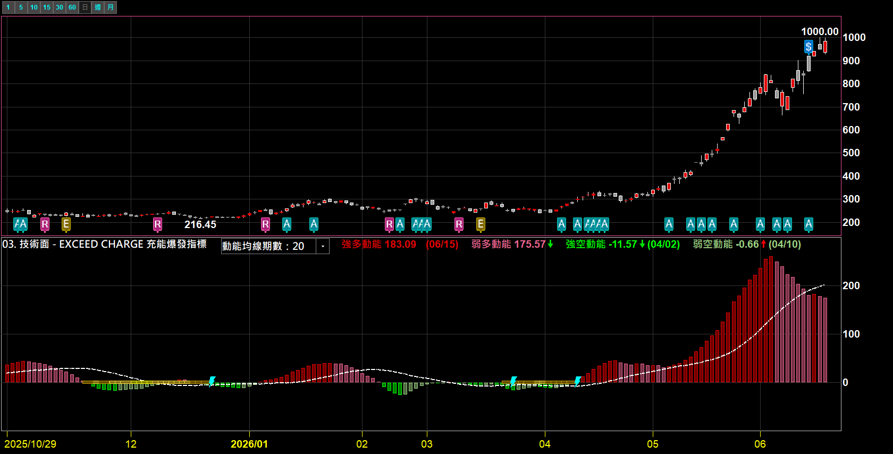
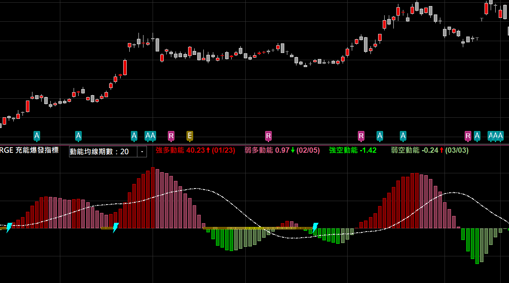
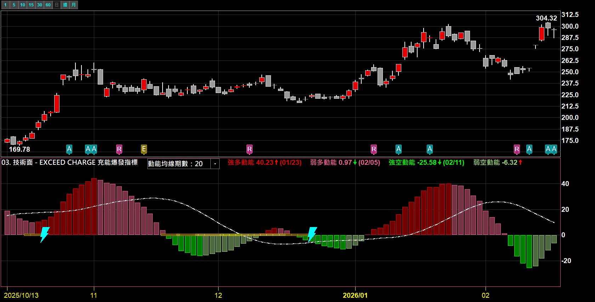
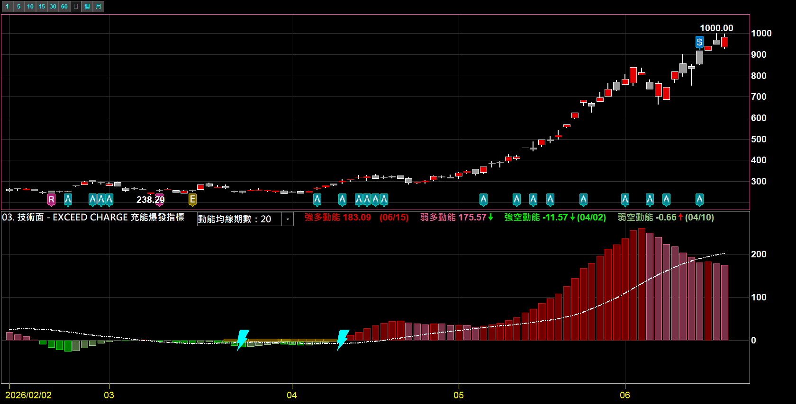

# EXCEED CHARGE 充能爆發指標

**把「市場先壓縮蓄能、再爆發噴出」的節奏，畫成一眼看得懂的副圖**

靈感來自經典的 Squeeze Momentum（擠壓動能），但做了更進一步的進化——壓縮分三級、動能分四色

 

 

  

[-3DDC84?style=for-the-badge)](https://github.com/mophyfei/MOFI_XQ/raw/main/03.%20%E6%8A%80%E8%A1%93%E9%9D%A2%E8%A7%80%E6%B8%AC/EXCEED%20CHARGE%20%E5%85%85%E8%83%BD%E7%88%86%E7%99%BC%E6%8C%87%E6%A8%99/03.%20%E6%8A%80%E8%A1%93%E9%9D%A2%20-%20EXCEED%20CHARGE%20%E5%85%85%E8%83%BD%E7%88%86%E7%99%BC%E6%8C%87%E6%A8%99%20%28%E8%80%81%E5%A2%A8%E5%84%AA%E6%83%A0%E7%A2%BC%EF%BC%9A%40MOFI%29.xsb)
&nbsp;

### 🔑 使用前必做：先綁定優惠碼 `@MOFI`

**本腳本需在 XQ 綁定優惠碼 `@MOFI` 才能解鎖使用**；綁定 `@MOFI` 為 XQ 平台官方推薦活動，可獲 XQ 點數 100 點折抵 👇

📣 **利益揭露**：綁定 `@MOFI` 為 XQ 平台官方推薦活動；老墨將因您綁定取得平台回饋（屬商業合作關係）。

> ⚠️ **使用前必讀**：本工具為**中性技術分析輔助工具**，僅呈現客觀的波動與動能狀態，**不提供任何個股買賣建議、不保證獲利**。老墨**非**經主管機關核准之證券投資顧問事業，本內容不構成投資推介。**歷史數據不代表未來表現**，投資決策與盈虧由使用者自行負責。

---

## 💡 這是什麼

很多人都用過 **Squeeze Momentum（擠壓動能）**——它的核心觀念是：當市場波動「縮」到很緊的時候，往往是在蓄積能量，一旦鬆開就容易走出一段比較有力道的行情。

**EXCEED CHARGE 把這個觀念做了兩層進化：**

1. **壓縮分三級** — 原本的擠壓只有「有壓／沒壓」二元判斷；這裡細分成 **微壓 → 中壓 → 極壓** 三個強度，縮得越緊代表蓄能越強。
2. **動能分四色** — 原本動能柱通常只分多／空兩種；這裡細到 **四色**，不只看方向，還看力道是在**加速**還是在**衰退**。

合起來，你在副圖上能一眼讀到一個完整故事：**現在縮多緊（蓄能）→ 鬆開了沒（釋放）→ 接下來往哪噴、噴得猛不猛（動能）**。

適合：喜歡「等盤整壓縮、抓波動轉折」這種節奏的人，當作判斷市場能量狀態的輔助參考。

---

## 🎨 畫面上有什麼

### 四色動能柱：看方向，也看力道

| 顏色 | 名稱 | 代表 |
|:---:|:---:|------|
| 🟥 **深紅** | 強多動能 | 在零軸上方、且比前一根更強 → 多方力道在**加速** |
| 🟧 **淺紅** | 弱多動能 | 在零軸上方、但比前一根弱 → 多方力道在**衰退** |
| 🟩 **深綠** | 強空動能 | 在零軸下方、且更往下（負值更深）→ 空方力道在**加速** |
| 🟢 **淺綠** | 弱空動能 | 在零軸下方、但比前一根強 → 跌勢在**收斂** |

> 白色虛線是**動能均線**，當作動能的趨勢參考。

### 三級擠壓 + 釋放：看蓄能與鬆開

- 零軸上那排**黃色橫段**＝市場正在壓縮（蓄能中），分微／中／極三級強度，越緊蓄能越強。
- **青藍色閃電 ⚡** ＝「擠壓釋放」，代表壓縮整個鬆開的那一根，是值得提高注意的觀察點。

### 蓄能 → 釋放 → 噴出：完整一輪

上圖就是典型的一輪：先是長時間的黃色壓縮（動能柱貼著零軸、很安靜）→ 出現釋放閃電 → 接著動能柱大幅放大、走出一段有力道的行情。

> 📌 以上皆為加權指數／匿名標的之功能示範畫面，**僅展示指標顯示，非個股推介或評價**。

---

## 🪜 怎麼用

1. **匯入指標** — 用 [🚀 一鍵匯入工具](https://github.com/mophyfei/MOFI_XQ/releases/latest/download/XQ-Script-Importer.exe) 匯入最快；或手動：XQ →「**策略**」→ **XScript 編輯器** →「**匯入**」→ 選 `.xsb` 檔 → 按 <kbd>F6</kbd> 編譯。
2. **加到技術分析圖** — 本指標顯示在**副圖**（主圖下方），加入後套用到任一檔商品（大盤、ETF、個股皆可）。
3. **設定顏色（首次）** — 四色動能柱、三級擠壓燈號、釋放點的顏色都可在 XQ 前台自訂；可參考上方截圖的配色（深紅／淺紅／深綠／淺綠＋黃色擠壓＋青藍釋放）。
4. **讀畫面** — 先看黃色擠壓（蓄能到哪一級）、再看有沒有釋放閃電、最後看動能柱的顏色與長短（往哪噴、力道強弱）。

---

## ⚙️ 參數說明

| 參數 | 說明 | 預設值 | 可選 |
|------|------|:---:|------|
| **計算期數** | 壓縮與動能的計算回看區間。期數越長越平滑、越短越靈敏 | 20 | 自訂 |
| **動能均線期數** | 動能均線（白虛線）的平滑天數，當動能的趨勢參考 | 20 | 20／60／120／240 |

---

## 🧩 需要的 XQ 模組

本腳本為**自訂 XScript 指標**，需訂閱：

| 模組 | 解鎖 | 本腳本 |
|------|------|:---:|
| **盤中量化交易模組** $1,000/月 | 自訂指標／XScript、策略雷達、警示、回溯、自動交易 | ✅ 必要 |

> 💡 自訂指標屬「盤中量化交易模組」。本指標只用到價量資料，**不需**盤後或美股模組。手機僅限監控訊號，完整功能需電腦版。[XQ 模組比較](https://www.xq.com.tw/module-compare/)。

---

## ⚠️ 注意事項與免責聲明

- 🔑 需在 XQ 綁定優惠碼 **`@MOFI`** 才能解鎖使用
- 📣 **利益揭露**：綁定 `@MOFI` 為 XQ 平台官方推薦活動；老墨將因您綁定取得平台回饋（屬商業合作關係）
- 本工具為中性技術分析輔助工具，畫面皆為依客觀數據計算的波動與動能狀態，**不代表未來、不構成買賣建議、不保證獲利**
- 老墨**非**經主管機關核准之證券投資顧問事業；本內容不構成投資推介或分析意見
- 所有腳本僅供技術研究與教學用途；投資決策與盈虧由使用者自行負責

---

[← 回到腳本庫首頁](../../README.md) ·  老墨 XQ 腳本庫 · 解鎖優惠碼 `@MOFI`

