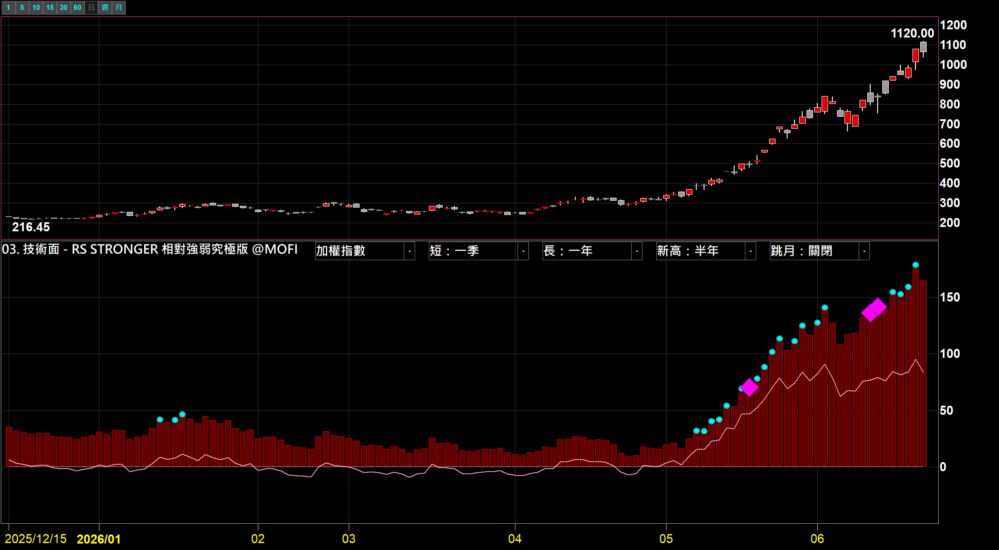
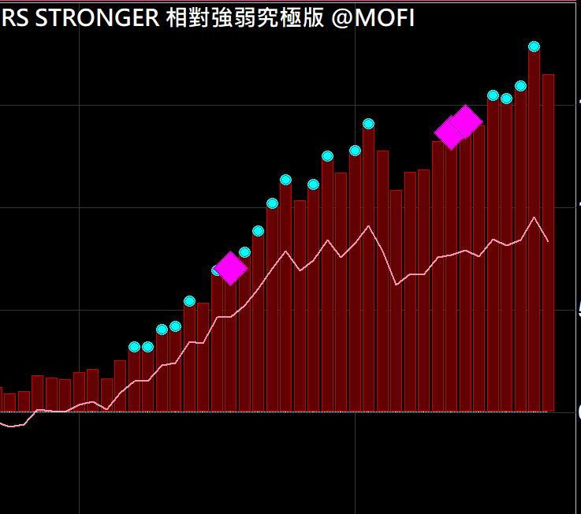
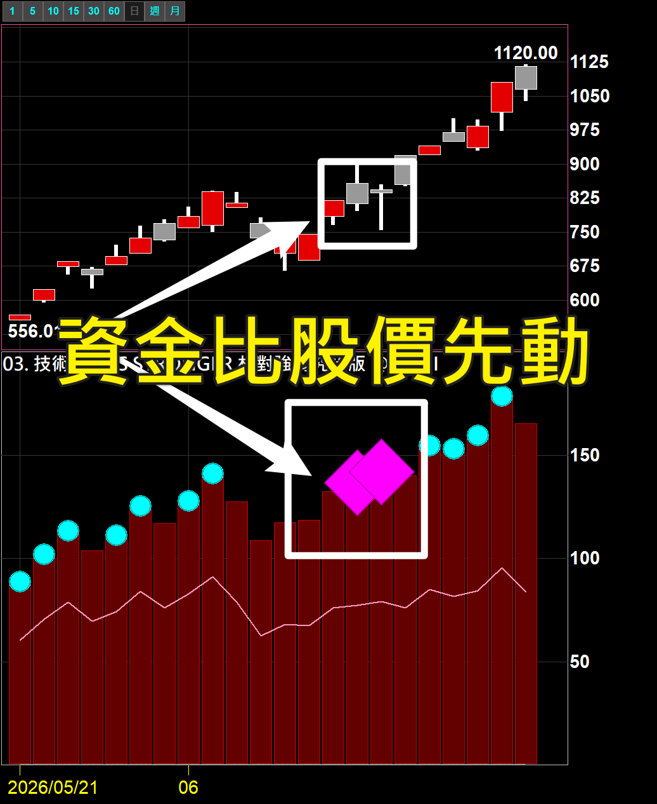

# RS STRONGER 相對強弱究極版

**一眼看出這檔到底有沒有比大盤強、強在哪、資金有沒有提前卡位**

用「連續 RS 線」當引擎的相對強弱指標，把個股 vs 大盤的強弱畫成繞零軸的振盪，並標出最關鍵的轉強與背離訊號

 

 

  

[-3DDC84?style=for-the-badge)](https://github.com/mophyfei/MOFI_XQ/raw/main/03.%20%E6%8A%80%E8%A1%93%E9%9D%A2%E8%A7%80%E6%B8%AC/RS%20STRONGER%20%E7%9B%B8%E5%B0%8D%E5%BC%B7%E5%BC%B1%E7%A9%B6%E6%A5%B5%E7%89%88/03.%20%E6%8A%80%E8%A1%93%E9%9D%A2%20-%20RS%20STRONGER%20%E7%9B%B8%E5%B0%8D%E5%BC%B7%E5%BC%B1%E7%A9%B6%E6%A5%B5%E7%89%88%20%28%E8%80%81%E5%A2%A8%E5%84%AA%E6%83%A0%E7%A2%BC%EF%BC%9A%40MOFI%29.xsb)
&nbsp;

### 🔑 使用前必做：先綁定優惠碼 `@MOFI`

**本腳本需在 XQ 綁定優惠碼 `@MOFI` 才能解鎖使用**；綁定 `@MOFI` 為 XQ 平台官方推薦活動，可獲 XQ 點數 100 點折抵 👇

📣 **利益揭露**：綁定 `@MOFI` 為 XQ 平台官方推薦活動；老墨將因您綁定取得平台回饋（屬商業合作關係）。

> ⚠️ **使用前必讀**：本工具為**中性技術分析輔助工具**，僅呈現個股相對大盤的客觀強弱數據，**不提供任何個股買賣建議、不保證獲利**。老墨**非**經主管機關核准之證券投資顧問事業，本內容不構成投資推介。**歷史數據不代表未來表現**，投資決策與盈虧由使用者自行負責。

---

## 💡 這是什麼

> **解決的問題：找出比大盤強、而且資金比股價先動的領導股。**

股票漲不夠看，要漲得「比大盤強」才是真有資金在追。RS STRONGER 把個股相對大盤的強弱畫成一條繞零軸的振盪：**0 以上＝這檔正在跑贏大盤、轉強；0 以下＝落後大盤**。

它跟一般 RS 不同的地方，是用**連續 RS 線**當引擎（每根都算個股／大盤的比值，再餵給均線與新高偵測），所以能做到舊版做不到的「**RS 創新高**」與「**RS 領先股價**」這種更前緣的判斷。

---

## 🎨 畫面上有什麼

| 元件 | 畫面 | 代表 |
|---|:---:|------|
| **短線 RS** | 粉色線 | 個股相對大盤、對短期均線的強弱 |
| **長線 RS** | 柱體（正為紅、負為綠）| 相對大盤、對長期均線的強弱（趨勢參考）|
| **零軸** | 中線 | 0 以上＝強過大盤、以下＝落後 |
| **動能加速** | 訊號點 | 短線 RS 上穿長線 RS，相對動能在加速 |
| **轉強** | 訊號點 | 長線 RS 上穿零軸（Weinstein 突破確認）|
| **RS 創新高**（青點）| 訊號點 | RS 線突破前 N 日高，相對強度走到新高 |
| **RS 領先股價**（洋紅菱形）| 訊號點 | RS 創高、但股價還沒創高 |

> 訊號顏色可在 XQ 前台自訂；截圖中**青色點**為 RS 強勢訊號、**洋紅菱形**為「RS 領先股價」。

### 關鍵訊號：資金比股價先動

當 **RS 已經創新高、股價卻還在原地盤整**，代表相對強度領先了股價——這就是「**資金比股價先動**」的背離。這是一般「兩點漲跌幅」式 RS 給不了的觀察。

---

## 🪜 怎麼用

1. **匯入指標** — 用 [🚀 一鍵匯入工具](https://github.com/mophyfei/MOFI_XQ/releases/latest/download/XQ-Script-Importer.exe) 匯入最快；或手動：XQ →「**策略**」→ **XScript 編輯器** →「**匯入**」→ 選 `.xsb` 檔 → 按 <kbd>F6</kbd> 編譯。
2. **加到技術分析圖** — 本指標顯示在**副圖**，加到任一檔個股的技術分析圖。
3. **選對照基準** — 在參數選「大盤」：台股可選加權／櫃買／0050／正二，美股可選 S&P 500／Nasdaq 100／Russell 2000／VT／道瓊。
4. **讀畫面** — 先看 RS 在零軸上或下（強過還落後大盤）、再看訊號點（轉強、動能加速、RS 創新高、RS 領先股價）。

---

## ⚙️ 參數說明

| 參數 | 說明 | 預設值 | 可選 |
|------|------|:---:|------|
| **大盤** | 相對強弱的對照基準 | 加權指數 | 加權／櫃買／0050／正二／S&P500／Nasdaq100／Russell2000／VT／道瓊 |
| **短期均線** | RS 線的短均 | 一季（60）| 一月／一季／半年／一年 |
| **長期均線** | RS 線的長均 | 一年（240）| 一月／一季／半年／一年 |
| **RS 創新高回看** | RS 創新高的回看區間 | 半年（120）| 一月／一季／半年／一年 |
| **skip-month 跳月** | 開啟後以「最近 20 個交易日之前」評估，濾短期反轉雜訊（學術 12-1 精神）；代價是訊號延後約一個月 | 關閉 | 開啟／關閉 |

---

## 🧩 需要的 XQ 模組

本腳本為**自訂 XScript 指標**：

| 模組 | 解鎖 | 本腳本 |
|------|------|:---:|
| **盤中量化交易模組** $1,000/月 | 自訂指標／XScript、策略雷達、警示、回溯、自動交易 | ✅ 必要 |
| **美股分析模組** $500/月 | 美股即時行情、XS 美股欄位 | 🔸 **僅當「大盤」選美股指數**（S&P500／Nasdaq100 等）時才需要 |

> 💡 自訂指標屬「盤中量化交易模組」。對照基準用台股（加權／櫃買／0050…）時不需美股模組；選美股指數當基準才需要。手機僅限監控訊號，完整功能需電腦版。[XQ 模組比較](https://www.xq.com.tw/module-compare/)。

---

## ⚠️ 注意事項與免責聲明

- 🔑 需在 XQ 綁定優惠碼 **`@MOFI`** 才能解鎖使用
- 📣 **利益揭露**：綁定 `@MOFI` 為 XQ 平台官方推薦活動；老墨將因您綁定取得平台回饋（屬商業合作關係）
- 本工具為中性技術分析輔助工具，畫面皆為依客觀數據計算的相對強弱，**不代表未來、不構成買賣建議、不保證獲利**
- 老墨**非**經主管機關核准之證券投資顧問事業；本內容不構成投資推介或分析意見
- 圖例皆為功能示範（加權指數／匿名標的），**非個股推介或評價**
- 所有腳本僅供技術研究與教學用途；投資決策與盈虧由使用者自行負責

---

[← 回到腳本庫首頁](../../README.md) ·  老墨 XQ 腳本庫 · 解鎖優惠碼 `@MOFI`

