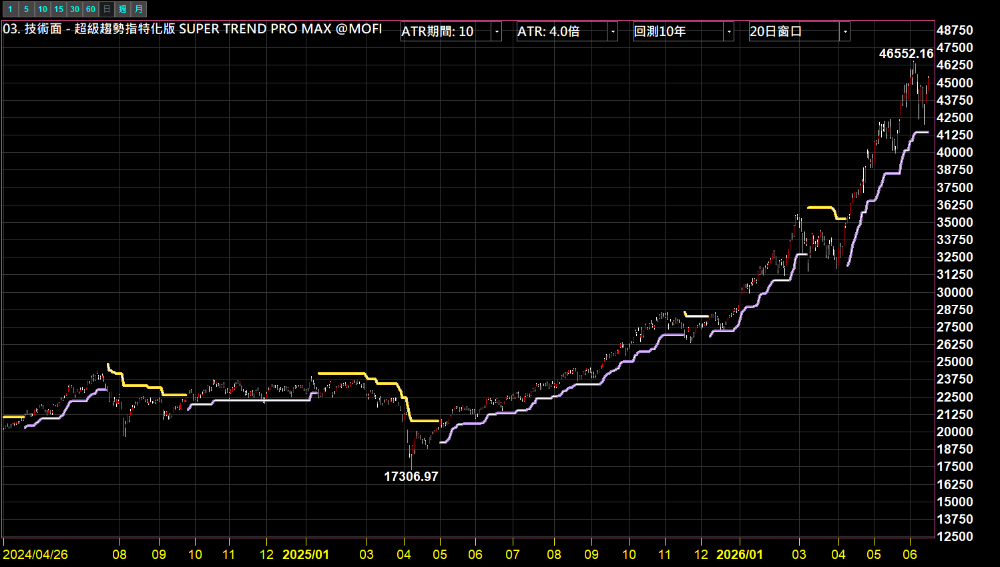
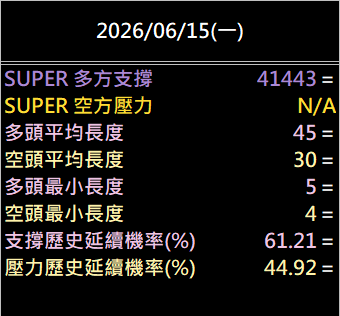
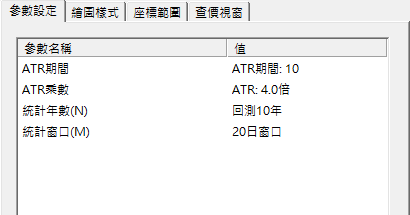

# 超級趨勢特化版 · SUPER TREND PRO MAX

**SuperTrend 趨勢線 ＋ 過去 10 年趨勢延續的歷史統計引擎**

不只看現在是多是空，還能對照這檔標的歷史上的趨勢平均壽命與延續機率

 

 

  

[-3DDC84?style=for-the-badge)](https://github.com/mophyfei/MOFI_XQ/raw/main/03.%20%E6%8A%80%E8%A1%93%E9%9D%A2%E8%A7%80%E6%B8%AC/SUPER%20TREND%20PRO%20MAX%20%E8%B6%85%E7%B4%9A%E8%B6%A8%E5%8B%A2%E7%89%B9%E5%8C%96%E7%89%88/03.%20%E6%8A%80%E8%A1%93%E9%9D%A2%20-%20%E8%B6%85%E7%B4%9A%E8%B6%A8%E5%8B%A2%E7%89%B9%E5%8C%96%E7%89%88%20SUPER%20TREND%20PRO%20MAX%20%28%E8%80%81%E5%A2%A8%E5%84%AA%E6%83%A0%E7%A2%BC%EF%BC%9A%40MOFI%29.xsb)
&nbsp;

### 🔑 使用前必做：先綁定優惠碼 `@MOFI`

**本腳本需在 XQ 綁定優惠碼 `@MOFI` 才能解鎖使用**；綁定 `@MOFI` 為 XQ 平台官方推薦活動，可獲 XQ 點數 100 點折抵 👇

📣 **利益揭露**：綁定 `@MOFI` 為 XQ 平台官方推薦活動；老墨將因您綁定取得平台回饋（屬商業合作關係）。

> ⚠️ **使用前必讀**：本工具為**中性技術分析輔助工具**，僅呈現歷史統計數據，**不提供任何個股買賣建議、不保證獲利**。老墨**非**經主管機關核准之證券投資顧問事業，本內容不構成投資推介。**歷史統計不代表未來表現**，投資決策與盈虧由使用者自行負責。

---

## 💡 這是什麼

> **解決的問題：檢查趨勢反轉神器。**

一般的 SuperTrend 指標只會畫一條線標示「目前為多頭或空頭」。**SUPER TREND PRO MAX** 在此之上，加掛一層**歷史統計引擎**：自動回測過去 N 年（預設 10 年）的所有趨勢波段，計算並呈現：

- 趨勢的**平均持續長度**與**最短持續長度**
- **歷史延續機率**：過去該趨勢在「其後 M 日」內未發生翻轉的歷史比率（純歷史統計）

讓你在看趨勢線的同時，也能對照這檔標的過去的趨勢統計特性。

---

## 🪜 怎麼用

<table>
<tr>
<td width="50%" valign="top">

**1️⃣ 匯入指標**

用 [🚀 一鍵匯入工具](https://github.com/mophyfei/MOFI_XQ/releases/latest/download/XQ-Script-Importer.exe) 匯入，或手動匯入後按 <kbd>F6</kbd> 編譯。

**2️⃣ 加到技術分析圖**

**加入指標** → 套用到任一檔標的的 K 線圖。趨勢線會畫在主圖，統計數據顯示在左側數值欄。

**3️⃣ 依需求調整參數**

4 個參數都做成下拉選單，一鍵切換（見下方參數說明）。

</td>
<td width="50%" valign="top">

| 顏色 | 意義 |
|:---:|---|
| 🟣 淡紫線 | **多方支撐**：股價在線上方＝多頭 |
| 🟡 黃線 | **空方壓力**：股價在線下方＝空頭 |
| 🔄 顏色切換 | **趨勢翻轉**（紫轉黃＝轉空，反之轉多） |

</td>
</tr>
</table>

---

## 📊 數值欄說明

左側數值欄即時顯示以下歷史統計（皆為純描述性數據）：

| 數值 | 意思 |
|------|------|
| **SUPER 多方支撐 / 空方壓力** | 目前趨勢線的價位（當下只會顯示一個，另一個顯示 N/A） |
| **多頭／空頭平均長度** | 過去 10 年，多／空頭趨勢平均持續的 K 棒根數 |
| **多頭／空頭最小長度** | 過去 10 年最短一段趨勢的 K 棒根數 |
| **支撐歷史延續機率(%)** | 過去 10 年，多頭趨勢在其後 M 日內未翻轉的歷史比率 |
| **壓力歷史延續機率(%)** | 過去 10 年，空頭趨勢在其後 M 日內未翻轉的歷史比率 |

> 📌 **功能示範**：上方封面以**大盤指數（加權指數）**為例，**僅示範指標顯示，非個股推介**。圖中所有數值皆為**歷史統計，非未來預測**。

---

## ⚙️ 參數說明

4 個參數都做成下拉選單，一鍵切換：

| 參數 | 說明 | 預設值 | 可選 |
|------|------|--------|------|
| ATR期間 | 計算波幅的 ATR 週期，越大越平滑 | 10 | 10 / 14 / 20 |
| ATR乘數 | 軌道寬度，越大趨勢線越不易翻轉 | 4.0 | 4.0 / 3.0 / 2.0 / 1.5 |
| 統計年數 (N) | 回測過去幾年的歷史波段 | 10 年 | 10 / 5 / 3 / 1 年 |
| 統計窗口 (M) | 「歷史延續機率」的統計窗口（趨勢翻轉前回看幾日） | 20 日 | 20 / 5 / 10 / 60 日 |

---

## 🧩 需要的 XQ 模組

本腳本為**自訂 XScript 指標**，需訂閱含「自訂指標」功能的模組：

| 模組 | 解鎖 | 本腳本 |
|------|------|:---:|
| **盤中量化交易模組** $1,000/月 | 自訂指標／XScript、策略雷達、警示、回溯、自動交易 | ✅ 必要 |

> 💡 自訂指標屬「盤中量化交易模組」。手機僅限監控訊號，完整功能需電腦版。不確定方案？看 [XQ 模組比較](https://www.xq.com.tw/module-compare/)。

---

## ⚠️ 注意事項與免責聲明

- 🔑 需在 XQ 綁定優惠碼 **`@MOFI`** 才能解鎖使用
- 📣 **利益揭露**：綁定 `@MOFI` 為 XQ 平台官方推薦活動；老墨將因您綁定取得平台回饋（屬商業合作關係）
- 本工具為**中性技術分析輔助工具**，所有數值皆為**歷史統計值**，反映過去趨勢特性，**不代表未來、不構成買賣建議、不保證獲利**
- 老墨**非**經主管機關核准之證券投資顧問事業；本內容不構成投資推介或分析意見
- 所有腳本僅供技術研究與教學用途；投資決策與盈虧由使用者自行負責

---

[← 回到腳本庫首頁](../../README.md) ·  老墨 XQ 腳本庫 · 解鎖優惠碼 `@MOFI`

