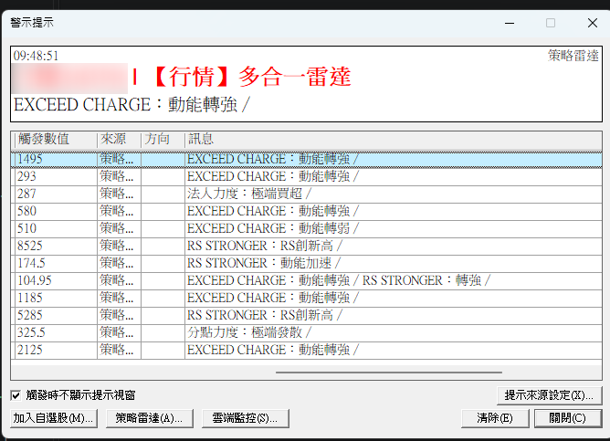
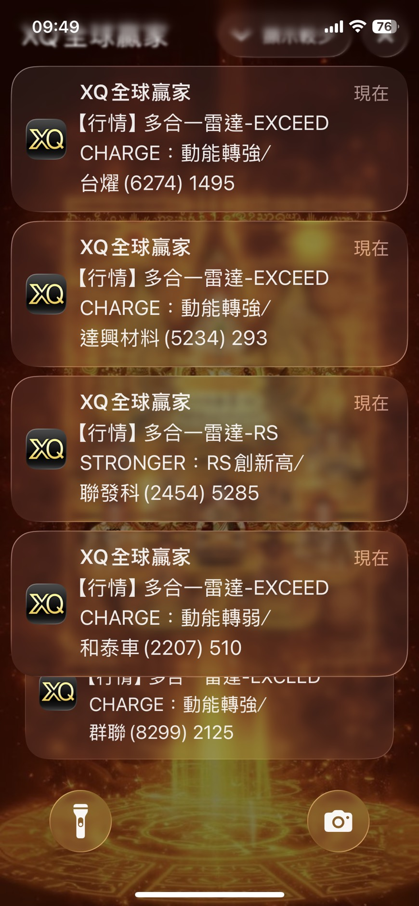
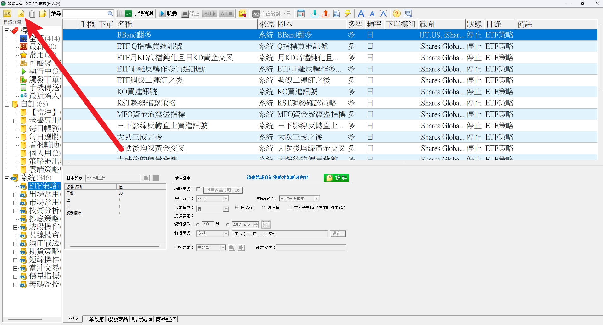
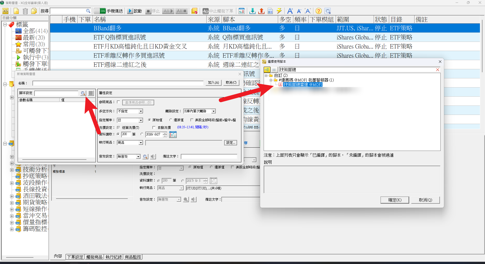
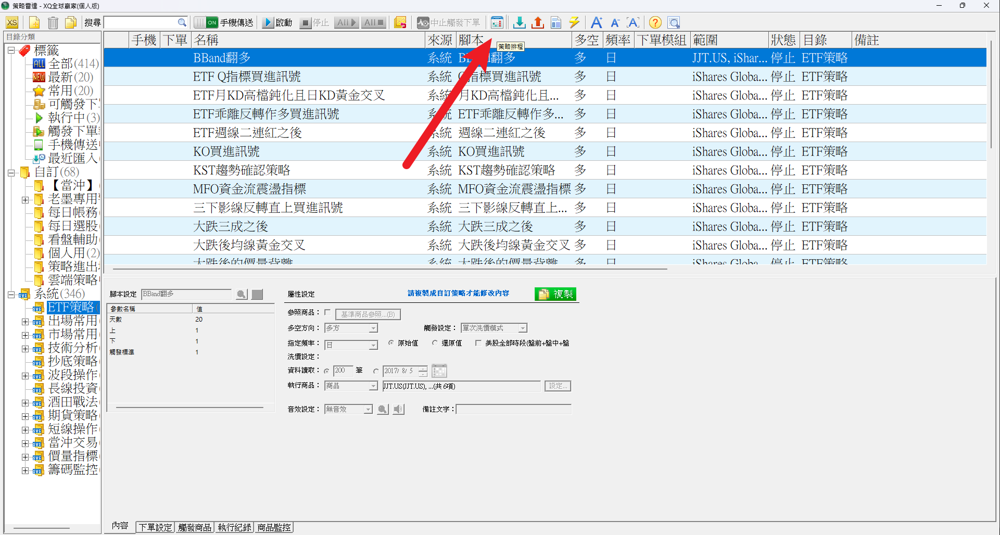
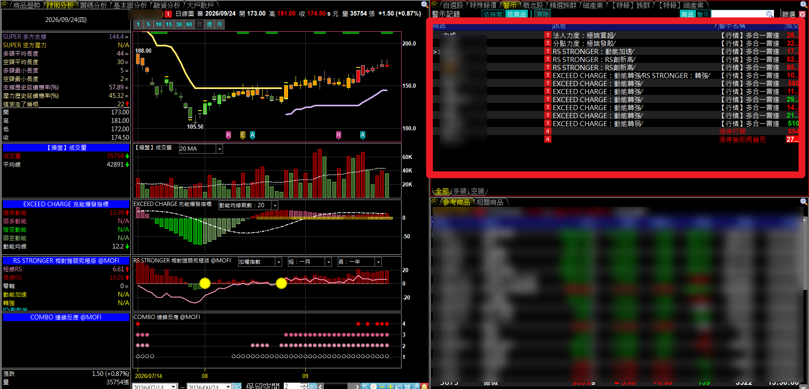
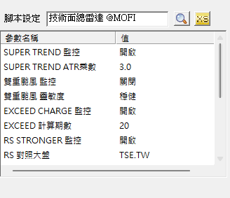

# 技術面總雷達（多合一警示）

**一支警示腳本，幫你一口氣盯住自選股的技術面與籌碼面動態**

SUPER TREND、雙重颱風、EXCEED CHARGE、RS STRONGER、分點力度、法人力度——六支指標的狀態一有變化就跳通知，還能推播到手機。只提醒、不下單

 

-4C8BF5?style=flat-square)

 

  

[-3DDC84?style=for-the-badge)](https://github.com/mophyfei/MOFI_XQ/raw/main/03.%20%E6%8A%80%E8%A1%93%E9%9D%A2%E8%A7%80%E6%B8%AC/%E6%8A%80%E8%A1%93%E9%9D%A2%E7%B8%BD%E9%9B%B7%E9%81%94/03.%20%E6%8A%80%E8%A1%93%E9%9D%A2%20-%20%E6%8A%80%E8%A1%93%E9%9D%A2%E7%B8%BD%E9%9B%B7%E9%81%94%20%28%E8%80%81%E5%A2%A8%E5%84%AA%E6%83%A0%E7%A2%BC%EF%BC%9A%40MOFI%29.xsb)
&nbsp;

### 🔑 使用前必做：先綁定優惠碼 `@MOFI`

**本腳本需在 XQ 綁定優惠碼 `@MOFI` 才能解鎖使用**；綁定 `@MOFI` 為 XQ 平台官方推薦活動，可獲 XQ 點數 100 點折抵 👇

---

## 💡 這是什麼

> **解決的問題：自選股二、三十檔，六支指標不可能一檔一檔點開來看。**

指標裝好了，但每天要一檔一檔切換、每張圖看六個副圖——自選股一多，根本看不完，真正有變化的那幾檔反而漏掉。

**技術面總雷達把「看」這件事交給 XQ。** 把它掛在「策略雷達」上，它會替你整份自選股逐檔檢查，哪一檔的哪一支指標狀態變了，就跳一則通知告訴你。你只需要看有通知的那幾檔。

**它只發通知、不下單**，腳本裡沒有任何買賣委託。

 

### 會提醒哪些變化

| 指標 | 會提醒的狀態變化 |
|---|---|
| [SUPER TREND PRO MAX](../SUPER%20TREND%20PRO%20MAX%20%E8%B6%85%E7%B4%9A%E8%B6%A8%E5%8B%A2%E7%89%B9%E5%8C%96%E7%89%88/) | 趨勢翻多／趨勢翻空 |
| [雙重颱風 K 線](../DOUBLE%20TYPHOON%20%E9%9B%99%E9%87%8D%E9%A2%B1%E9%A2%A8%20K%20%E7%B7%9A/) | 轉為強勢／轉為弱勢／轉為不明 |
| [EXCEED CHARGE](../EXCEED%20CHARGE%20%E5%85%85%E8%83%BD%E7%88%86%E7%99%BC%E6%8C%87%E6%A8%99/) | 擠壓釋放／進入極壓／動能轉強／動能轉弱 |
| [RS STRONGER](../RS%20STRONGER%20%E7%9B%B8%E5%B0%8D%E5%BC%B7%E5%BC%B1%E7%A9%B6%E6%A5%B5%E7%89%88/) | 動能加速／轉強／RS 創新高／RS 領先股價 |
| [分點力度](../../04.%20%E7%B1%8C%E7%A2%BC%E9%9D%A2%E8%A7%80%E6%B8%AC/%E5%88%86%E9%BB%9E%E5%8A%9B%E5%BA%A6/) | 極端集中／極端發散 |
| [法人力度](../../04.%20%E7%B1%8C%E7%A2%BC%E9%9D%A2%E8%A7%80%E6%B8%AC/%E6%B3%95%E4%BA%BA%E5%8A%9B%E5%BA%A6/) | 極端買超／極端賣超 |

💡 指標名稱可點擊，進到該支的完整說明頁看每種狀態的意思。雷達本身不需要另外裝這六支，計算都已經包在腳本裡。

籌碼兩支只在數值來到**極端**時才通知，平常的小波動不會打擾你。

---

## 📲 收到的通知長這樣

同一檔、同一天有好幾個變化時，會用「／」串在同一則通知裡，不會連發好幾則。

<table>
<tr>
<td width="62%" valign="top" align="center">

**電腦：警示視窗**

每一列是一則通知，「訊息」欄寫明是哪支指標、變成什麼狀態。

</td>
<td width="38%" valign="top" align="center">

**手機：推播通知**

人不在電腦前，一樣收得到。

</td>
</tr>
</table>

---

## 🪜 怎麼設定（重點在這裡）

> ⚠️ **這支是「警示腳本」，不是畫在 K 線圖上的指標。** 匯入後在技術分析圖上是找不到它的——要到**「策略」→「策略雷達」**裡加入，它才會開始運作。

### ① 匯入腳本

用 [🚀 一鍵匯入工具](https://github.com/mophyfei/MOFI_XQ/releases/latest/download/XQ-Script-Importer.exe) 匯入最快；或手動：XQ →「**策略**」→ **XScript 編輯器** →「**匯入**」→ 選 `.xsb` 檔 → 按 <kbd>F6</kbd> 編譯。

### ② 打開策略雷達，新增一個策略

XQ 上方選單點「**策略**」→「**策略雷達**」，再點左上角的**新增**按鈕。

 
▲ 策略雷達視窗，箭頭處是「新增」

 

### ③ 選腳本、選要監控的股票

在「新增策略雷達」視窗裡：

1. **腳本設定**：點放大鏡，搜尋「技術面總雷達」，選你剛匯入的那支 → 確定
2. **指定頻率**：設成「**日**」（這支只能掛日 K，其他頻率會直接擋掉）
3. **執行商品**：按「設定」，選你要監控的自選股清單
4. 取個名稱 → 按「**加入**」

 
▲ 點「腳本設定」旁的放大鏡，在右邊視窗找到技術面總雷達

 

### ④ 設定排程，讓它每天自動開跑

點上方工具列的「**策略排程**」，設定每天自動啟動的時間，就不用每天手動按啟動。

 
▲ 箭頭處是「策略排程」

 

### ⑤ 想收手機推播

策略雷達上方工具列有「**手機傳送**」開關，打開後通知會同步推到手機上的 XQ App。

---

## 🖥️ 搭配 ZERO SYSTEM：今天誰觸發，點一下就看到圖

如果你用的是老墨的看盤版面 **[ZERO SYSTEM PRO MAX](../../00.%20%E7%9C%8B%E7%9B%A4%E9%A0%81%E9%9D%A2/ZERO%20SYSTEM%20PRO%20MAX/)**，右側報價區切到「**警示**」頁籤，就會列出今天觸發雷達的股票和訊息。點其中一檔，左邊的看盤畫面馬上換成那檔，指標全部掛好，不用自己再搜代號、開圖。

 
▲ 右上紅框：「警示」頁籤列出今天的雷達通知；點一檔，左邊整套指標跟著切換

---

## ⚙️ 開關與參數

每支指標都有自己的**監控開關**（預設全開），不想被某支打擾就單獨關掉，其他照常運作。

 

| 指標 | 可以調的 |
|---|---|
| SUPER TREND | 監控開關、ATR 乘數（下拉選 1.5～4.0） |
| 雙重颱風 | 監控開關、靈敏度（靈敏／穩健） |
| EXCEED CHARGE | 監控開關、計算期數 |
| RS STRONGER | 監控開關、對照大盤（預設加權指數 `TSE.TW`） |
| 分點力度 | 監控開關、極端靈敏度（靈敏／適中／嚴格） |
| 法人力度 | 監控開關、看哪個法人（三大法人／外資／投信／自營）、標準化方式、極端靈敏度 |
| 籌碼共用 | 近期動向天數、極端值比較區間 |

預設值為老墨個人使用習慣，可依自己的交易週期調整。

---

## 🧩 需要的 XQ 模組

| 模組 | 需要嗎 | 為什麼 |
|------|:---:|------|
| **盤中量化交易模組** $1,000/月 | ✅ **必備** | 自訂腳本、策略雷達、警示都靠這個模組 |
| **籌碼模組** $500/月 | 🔸 選配 | 只有把雷達掛在**產業類股指數**上、要看整個族群的分點與法人動向時才需要；監控個股免加購 |

手機僅限監控訊號，完整功能需電腦版。[XQ 模組比較](https://www.xq.com.tw/module-compare/)

---

## 📌 使用須知

- 🔑 需在 XQ 綁定優惠碼 **`@MOFI`** 才能解鎖
- 📅 **限日 K 使用**（原始日 K、還原日 K 都可以），設成其他頻率會直接跳出提醒
- 🕐 **籌碼兩支用的是每日盤後資料**，盤中不會即時變動，要等收盤結算後才會判斷
- 🔕 不想收某支指標的通知，到參數把它的監控開關關掉即可
- 📐 參數預設值為老墨個人使用習慣

---

## ⚠️ 免責聲明與利益揭露

**📣 利益揭露**
綁定優惠碼 `@MOFI` 為 XQ 平台官方推薦活動；老墨將因您綁定取得平台回饋，屬商業合作關係。

**工具性質**
本腳本為中性技術分析輔助工具，功能為在指標狀態改變時發出通知。通知內容僅描述指標的技術狀態，不構成任何買賣建議、不對後續走勢作出研判、不保證獲利。腳本不含任何下單指令。

**非投顧事業**
老墨非經主管機關核准之證券投資顧問事業。本頁面全部內容不構成投資推介、分析意見或任何形式之投資顧問服務。

**關於本頁截圖**
本頁所有畫面截圖中出現之商品代號、名稱、報價與數值，均僅為功能示範，非推介標的，不代表老墨持有該等商品或建議買賣。

**歷史數據之限制**
所有數值均為對過去資料之計算，歷史表現不代表未來結果。程式邏輯與資料來源均可能存在誤差。

**風險自負**
本腳本僅供技術研究與教學用途。任何投資決策應由使用者依自身判斷為之，所生盈虧由使用者自行承擔。

---

[← 回到腳本庫首頁](../../README.md) ·  老墨 XQ 腳本庫 · 解鎖優惠碼 `@MOFI`

