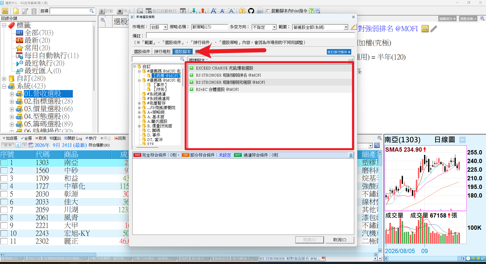
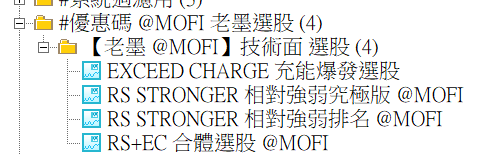
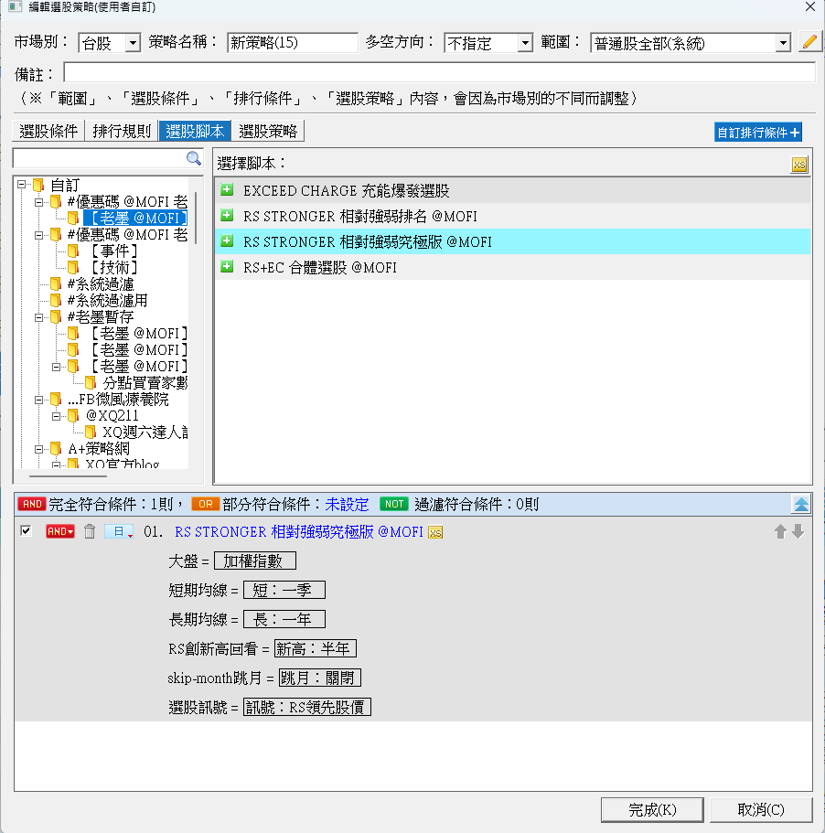
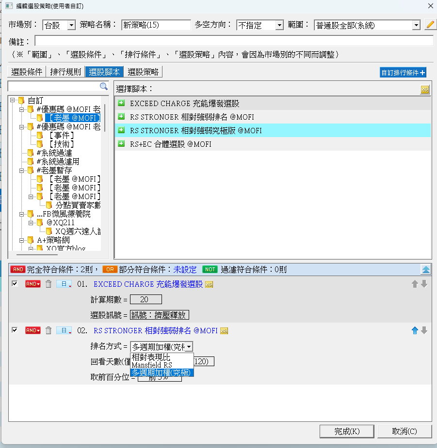
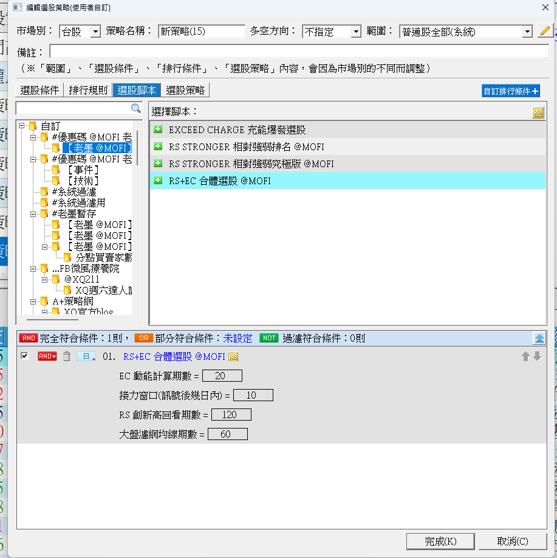
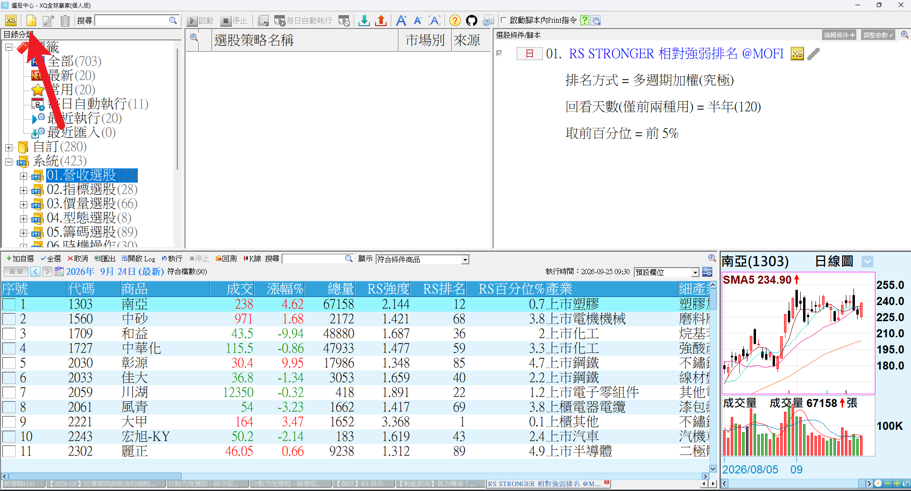

# 老墨的技術面選股組合

**把 EXCEED CHARGE 和 RS STRONGER 搬進選股中心——全市場一次掃完，不用一檔一檔看圖**

四支選股腳本打包成一個檔：充能爆發選股、相對強弱究極版、相對強弱排名、RS＋EC 合體選股

 

 

  

[-3DDC84?style=for-the-badge)](https://github.com/mophyfei/MOFI_XQ/raw/main/03.%20%E6%8A%80%E8%A1%93%E9%9D%A2%E8%A7%80%E6%B8%AC/%E6%8A%80%E8%A1%93%E9%9D%A2%E9%81%B8%E8%82%A1%E7%B5%84%E5%90%88/03.%20%E6%8A%80%E8%A1%93%E9%9D%A2%20-%20%E8%80%81%E5%A2%A8%E6%8A%80%E8%A1%93%E9%9D%A2%E9%81%B8%E8%82%A1%E7%B5%84%E5%90%88%20%28%E8%80%81%E5%A2%A8%E5%84%AA%E6%83%A0%E7%A2%BC%EF%BC%9A%40MOFI%29.xsb)
&nbsp;

### 🔑 使用前必做：先綁定優惠碼 `@MOFI`

**本組腳本需在 XQ 綁定優惠碼 `@MOFI` 才能解鎖使用**；綁定 `@MOFI` 為 XQ 平台官方推薦活動，可獲 XQ 點數 100 點折抵 👇

---

## 💡 這是什麼

> **解決的問題：指標只能一檔一檔看，全市場一千多檔，看不完。**

[EXCEED CHARGE](../EXCEED%20CHARGE%20%E5%85%85%E8%83%BD%E7%88%86%E7%99%BC%E6%8C%87%E6%A8%99/) 和 [RS STRONGER](../RS%20STRONGER%20%E7%9B%B8%E5%B0%8D%E5%BC%B7%E5%BC%B1%E7%A9%B6%E6%A5%B5%E7%89%88/) 畫在 K 線圖上很好用，但一次只能看一檔。想知道「今天全市場有哪些股票出現這個狀態」，就得換個工具——**XQ 的選股中心**。

這組腳本就是把這兩支指標改寫成「選股版」：丟進選股中心按一次執行，全市場符合條件的股票直接列成清單。

 
▲ 匯入後，四支腳本會出現在同一個資料夾

---

## 🧭 四支腳本，各做什麼

| 腳本 | 一句話 | 結果清單會多出的欄位 |
|---|---|---|
| **EXCEED CHARGE 充能爆發選股** | 找出正在擠壓蓄能、剛釋放，或動能正在加速的股票 | 動能值 |
| **RS STRONGER 相對強弱究極版** | 找出相對大盤剛轉強、創新高，或 RS 領先股價的股票 | 長線 RS、短線 RS |
| **RS STRONGER 相對強弱排名** | 把全市場依相對強弱排名，只留前面那一段 | RS 強度、RS 排名、RS 百分位% |
| **RS＋EC 合體選股** | 動能與相對強弱兩個訊號接力出現、且大盤環境配合時才入選 | 五星合體、RS 創幾日新高、EC 幾日前翻正、大盤收盤、大盤 60MA |

 

### EXCEED CHARGE 充能爆發選股

「選股訊號」下拉四選一：

| 選項 | 找什麼 |
|---|---|
| 極壓蓄能 | 波動收縮到最緊的股票 |
| 擠壓釋放 | 擠壓剛鬆開的股票 |
| 強多動能 | 動能在零軸之上、而且還在變強 |
| 強空動能 | 動能在零軸之下、而且還在變弱 |

 

### RS STRONGER 相對強弱究極版

 

| 參數 | 說明 |
|---|---|
| 大盤 | 要跟哪個指數比：加權指數、櫃買指數、0050、正二，或 S&P 500、Nasdaq 100 等美股指數 |
| 短期均線／長期均線 | RS 線的短、長觀察區間（一月／一季／半年／一年） |
| RS 創新高回看 | 「創新高」要跟過去多久比（一月～一年） |
| skip-month 跳月 | 開啟時，計算略過最近一個月，減少短線漲跌的干擾 |
| 選股訊號 | 四選一：RS 領先股價／RS 創新高／RS 轉強／動能加速 |

訊號的意思跟指標版一樣，詳見 [RS STRONGER 說明頁](../RS%20STRONGER%20%E7%9B%B8%E5%B0%8D%E5%BC%B7%E5%BC%B1%E7%A9%B6%E6%A5%B5%E7%89%88/)。

 

### RS STRONGER 相對強弱排名

跟上一支不同，這支**不看訊號、只看排名**：全市場每一檔都算一個「相對大盤有多強」的分數，由強到弱排好，只留下前面那一段。

 
▲ 「排名方式」有三種可選

 

**三種排名方式，差在「怎麼定義強」：**

| 排名方式 | 怎麼算強 | 適合 |
|---|---|---|
| **相對表現比** | 這段期間，個股漲幅跑贏大盤多少 | 最直覺：誰這半年／一年跑得比大盤好 |
| **Mansfield RS** | 個股相對大盤的強度，現在比它自己過去的平均水準高出多少 | 看「最近轉強」，剛走強的股票容易排上來 |
| **多週期加權（究極）** | 把近一季、半年、三季、一年的相對表現綜合打分，越近期的比重越高 | 兼顧長短期，避免只被某一段行情影響 |

另外兩個下拉：

- **回看天數**：半年或一年，只對前兩種排名方式有作用（究極版自己會看多個週期）
- **取前百分位**：只留排名前 5%／10%／20%／33% 的股票

 

### RS＋EC 合體選股

把 EXCEED CHARGE 的動能和 RS STRONGER 的相對強弱接在一起用：兩個訊號在一段時間內先後出現，而且大盤本身狀態不差，才會入選。

 

| 參數 | 說明 |
|---|---|
| EC 動能計算期數 | 動能的計算天數 |
| 接力窗口（訊號後幾日內） | 兩個訊號要在幾天之內接連出現才算 |
| RS 創新高回看期數 | 相對強弱「創新高」要跟過去多久比 |
| 大盤濾網均線期數 | 大盤要站在幾日均線之上 |

結果清單的「**五星合體**」欄：近期內 SUPER TREND、雙重颱風、EXCEED CHARGE、RS STRONGER、法人力度五類訊號全部出現過的股票，會標上 ★。

---

## 🪜 怎麼用（第一次用選股中心看這裡）

> ⚠️ **選股腳本不是畫在 K 線圖上的指標。** 要到 **「策略」→「選股中心」** 裡建立一個選股策略，把腳本放進去執行，才會跑出結果清單。

> 🎬 **第一次接觸選股中心？** 先看老墨的 [YouTube 選股中心教學播放清單](https://www.youtube.com/playlist?list=PLptgGeDpNkFnn4eRuAnVSNjiqO-PtdnfR)，從介面到實戰一步一步帶。

### ① 匯入腳本

用 [🚀 一鍵匯入工具](https://github.com/mophyfei/MOFI_XQ/releases/latest/download/XQ-Script-Importer.exe) 匯入最快；或手動：XQ →「**策略**」→ **XScript 編輯器** →「**匯入**」→ 選 `.xsb` 檔 → 按 <kbd>F6</kbd> 編譯。

### ② 打開選股中心，新增一個選股策略

XQ 上方選單點「**策略**」→「**選股中心**」，再點左上角的**新增**按鈕。

 
▲ 選股中心，箭頭處是「新增」

 

### ③ 切到「選股腳本」，把腳本加進來

在「新增選股策略」視窗切到「**選股腳本**」頁籤，左邊目錄找到你匯入的資料夾，右邊就會列出四支腳本，點綠色 **＋** 加入。

 
▲ 切到「選股腳本」頁籤，四支腳本都在這裡

 

### ④ 調參數 → 完成 → 執行

加進來的腳本會出現在下方，直接在那裡改參數，按「**完成**」存檔，回到選股中心按「**執行**」，結果清單就出來了。

> 💡 **可以疊加。** 同一個選股策略可以放好幾支腳本，預設是「AND」——全部條件都符合才入選。例如上面那張排名方式的截圖，就是「EXCEED CHARGE 擠壓釋放」＋「RS 排名前 5%」疊在一起用。

---

## 🧩 需要的 XQ 模組

| 模組 | 需要嗎 | 為什麼 |
|------|:---:|------|
| **盤後量化選股模組** $1,000/月 | ✅ **必備** | 選股中心與選股腳本都靠這個模組 |
| **美股分析模組** $500/月 | 🔸 選配 | 只有「相對強弱究極版」把大盤切到 S&P 500、Nasdaq 100 等**美股指數**時才需要；用台股大盤免加購 |

[XQ 模組比較](https://www.xq.com.tw/module-compare/)

---

## 📌 使用須知

- 🔑 需在 XQ 綁定優惠碼 **`@MOFI`** 才能解鎖
- 📅 四支都以**日線**計算，選股中心的頻率請設「日」
- 📦 一個 `.xsb` 檔內含四支腳本，匯入一次全部到位
- 📐 參數預設值為老墨個人使用習慣

---

## ⚠️ 免責聲明與利益揭露

**📣 利益揭露**
綁定優惠碼 `@MOFI` 為 XQ 平台官方推薦活動；老墨將因您綁定取得平台回饋，屬商業合作關係。

**工具性質**
本組腳本為中性技術分析輔助工具，功能為依使用者設定的技術條件篩出符合的商品。入選清單僅代表符合條件，不構成任何買賣建議、不對後續走勢作出研判、不保證獲利。

**非投顧事業**
老墨非經主管機關核准之證券投資顧問事業。本頁面全部內容不構成投資推介、分析意見或任何形式之投資顧問服務。

**關於本頁截圖**
本頁所有畫面截圖中出現之商品代號、名稱、報價與數值，均僅為功能示範，非推介標的，不代表老墨持有該等商品或建議買賣。

**歷史數據之限制**
所有數值均為對過去資料之計算，歷史表現不代表未來結果。程式邏輯與資料來源均可能存在誤差。

**風險自負**
本組腳本僅供技術研究與教學用途。任何投資決策應由使用者依自身判斷為之，所生盈虧由使用者自行承擔。

---

[← 回到腳本庫首頁](../../README.md) ·  老墨 XQ 腳本庫 · 解鎖優惠碼 `@MOFI`

