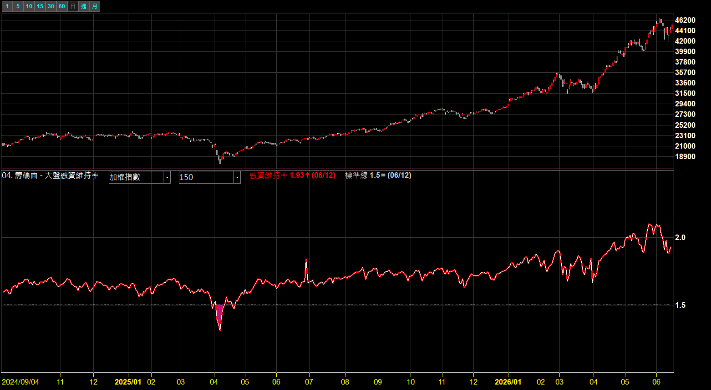
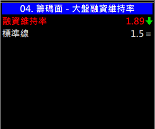
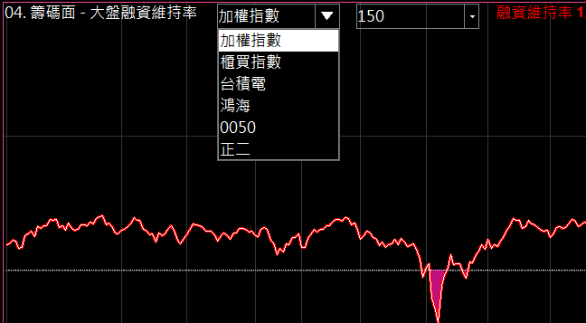
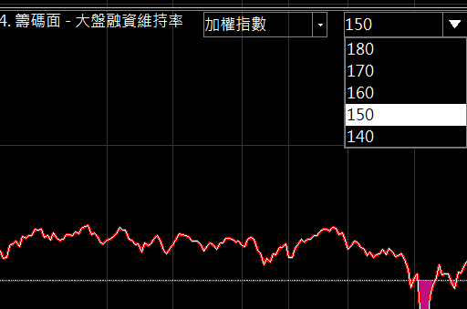

# 大盤融資維持率

**大盤融資戶的「槓桿安全度溫度計」**

融資維持率越低＝市場槓桿壓力越大、越接近追繳／斷頭區。跌破自訂標準線時自動填色警示

 

 

⚠️ 示意圖（加權指數），僅為功能示範，非投資建議

  

[-3DDC84?style=for-the-badge)](https://github.com/mophyfei/MOFI_XQ/raw/main/04.%20%E7%B1%8C%E7%A2%BC%E9%9D%A2%E8%A7%80%E6%B8%AC/%E5%A4%A7%E7%9B%A4%E8%9E%8D%E8%B3%87%E7%B6%AD%E6%8C%81%E7%8E%87/04.%20%E7%B1%8C%E7%A2%BC%E9%9D%A2%20-%20%E5%A4%A7%E7%9B%A4%E8%9E%8D%E8%B3%87%E7%B6%AD%E6%8C%81%E7%8E%87%20%28%E8%80%81%E5%A2%A8%E5%84%AA%E6%83%A0%E7%A2%BC%EF%BC%9A%40MOFI%29.xsb)
&nbsp;

### 🔑 使用前必做：先綁定優惠碼 `@MOFI`

**本腳本需在 XQ 綁定優惠碼 `@MOFI` 才能解鎖使用**；綁定 `@MOFI` 為 XQ 平台官方推薦活動，可獲 XQ 點數 100 點折抵 👇

📣 **利益揭露**：綁定 `@MOFI` 為 XQ 平台官方推薦活動；老墨將因您綁定取得平台回饋（屬商業合作關係）。

> ⚠️ **使用前必讀**：本工具為**中性技術分析輔助工具**，僅將公開的融資維持率資料視覺化，**不提供任何個股買賣建議、不保證獲利**。老墨**非**經主管機關核准之證券投資顧問事業，本內容不構成投資推介。**歷史數據不代表未來表現**，投資決策與盈虧由使用者自行負責。

---

## 💡 這是什麼

**融資維持率**反映融資戶的**槓桿安全度**：數值越低，代表融資擔保品相對融資金額越薄、越接近**追繳／斷頭**壓力。它常被當作市場槓桿風險的「溫度計」。

本指標把所選商品（預設**加權指數／大盤**）的融資維持率畫出來，並加一條可自訂的**標準線**：

- 維持率**跌破標準線** → 自動**填色警示**（如上方封面 2025/04 那段）
- 數值以**倍數**顯示（`1.5` = 150%、`1.93` = 193%）

讓你一眼看出**大盤槓桿風險是否升溫**（屬籌碼面客觀數據觀察，非買賣訊號）。

> 以上為融資交易制度之一般說明，非對後市漲跌之研判。

---

## 🪜 怎麼用

1. **匯入指標** — 用 [🚀 一鍵匯入工具](https://github.com/mophyfei/MOFI_XQ/releases/latest/download/XQ-Script-Importer.exe) 匯入，或手動匯入後按 <kbd>F6</kbd> 編譯。
2. **加到技術分析圖** — **加入指標** → 顯示於副圖（預設觀察加權指數大盤）。
3. **可切換商品與標準線** — 上方下拉可換觀察標的、調整警示標準線。

---

## 📊 數值欄說明

| 數值 | 意思 |
|------|------|
| **融資維持率** | 目前融資維持率（倍數，`1.5`＝150%） |
| **標準線** | 自訂的警示門檻；維持率跌破此線即填色提醒 |

> 📌 圖例以加權指數（大盤）示範，僅呈現客觀籌碼數據，非買賣建議。

---

## ⚙️ 參數說明

| 參數 | 說明 | 預設值 | 可選 |
|------|------|--------|------|
| 商品名稱 | 觀察哪個標的的融資維持率 | 加權指數 | 加權／櫃買／台積電／鴻海／0050／正二 |
| 標準線 | 警示門檻（跌破即填色） | 150 | 180 / 170 / 160 / 150 / 140 |

 &nbsp; 

> 💡 商品下拉為**可切換的觀察標的**，非個股推介；主要用於觀察**大盤**槓桿風險。個股維持率僅供槓桿觀察，非對該個股之買賣意見。

---

## ⚠️ 注意事項與免責聲明

- 🔑 需在 XQ 綁定優惠碼 **`@MOFI`** 才能解鎖使用
- 📣 **利益揭露**：綁定 `@MOFI` 為 XQ 平台官方推薦活動；老墨將因您綁定取得平台回饋（屬商業合作關係）
- 本工具為**中性技術分析輔助工具**，融資維持率為**公開籌碼數據**，反映市場槓桿狀態，**不代表未來、不構成買賣建議、不保證獲利**
- 老墨**非**經主管機關核准之證券投資顧問事業；本內容不構成投資推介或分析意見
- 所有腳本僅供技術研究與教學用途；投資決策與盈虧由使用者自行負責

---

[← 回到腳本庫首頁](../../README.md) ·  老墨 XQ 腳本庫 · 解鎖優惠碼 `@MOFI`

