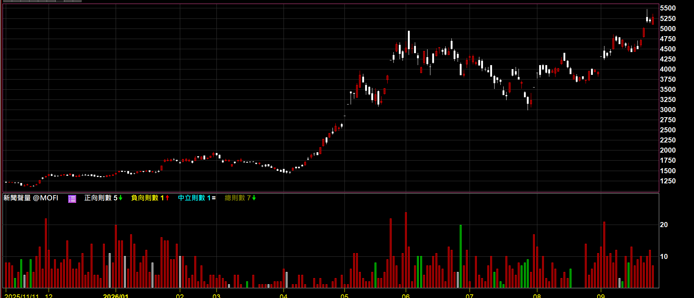
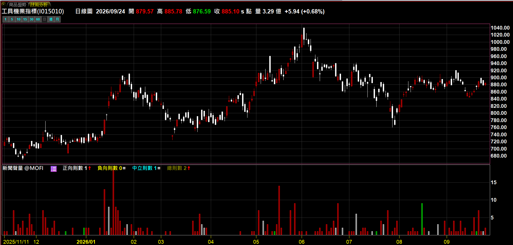
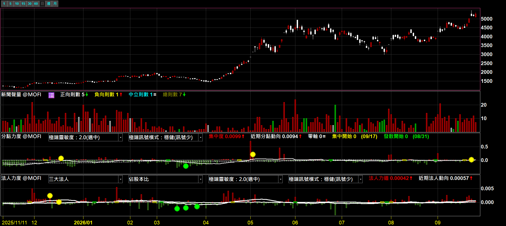
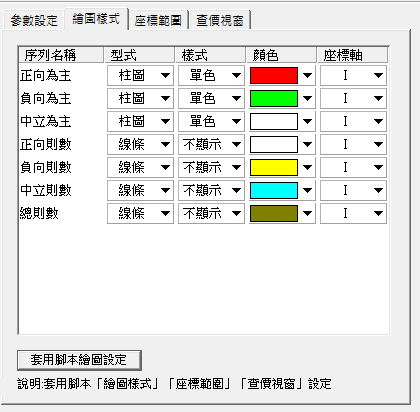

# 新聞聲量指標

**這檔股票今天被報導了幾次？報導的調性偏正面還是負面？一根柱子告訴你**

每天的新聞則數畫成柱狀圖，顏色代表當天正向、負向、中立哪一種最多。掛在產業指數上，還會自動加總整個族群的新聞

 

-4C8BF5?style=flat-square)

 

  

[-3DDC84?style=for-the-badge)](https://github.com/mophyfei/MOFI_XQ/raw/main/05.%20%E4%BA%8B%E4%BB%B6%E9%9D%A2%E8%A7%80%E6%B8%AC/%E6%96%B0%E8%81%9E%E8%81%B2%E9%87%8F/05.%20%E4%BA%8B%E4%BB%B6%E9%9D%A2%20-%20%E6%96%B0%E8%81%9E%E8%81%B2%E9%87%8F%E6%8C%87%E6%A8%99%20%28%E8%80%81%E5%A2%A8%E5%84%AA%E6%83%A0%E7%A2%BC%EF%BC%9A%40MOFI%29.xsb)
&nbsp;

### 🔑 使用前必做：先綁定優惠碼 `@MOFI`

**本腳本需在 XQ 綁定優惠碼 `@MOFI` 才能解鎖使用**；綁定 `@MOFI` 為 XQ 平台官方推薦活動，可獲 XQ 點數 100 點折抵 👇

---

## 💡 這是什麼

> **解決的問題：一檔股票最近到底多「有話題」？要一篇一篇翻新聞才知道。**

XQ 內建每檔個股每天的新聞則數，還分好正向、負向。但這些數字藏在欄位裡，沒辦法跟 K 線對著看，也看不出一段時間的變化。

**新聞聲量指標把它畫到 K 線下方**：每天一根柱子，高度是當天的新聞總則數，顏色是當天哪一種調性最多。話題什麼時候開始升溫、升溫時報導偏正面還是負面，跟股價放在一起一眼就看得到。

 

### 怎麼看

| 看什麼 | 代表 |
|---|---|
| **柱子高度** | 當天新聞總則數，越高代表越多報導 |
| 🟥 **紅色柱** | 當天「正向」新聞最多 |
| 🟩 **綠色柱** | 當天「負向」新聞最多 |
| ⬜ **白色柱** | 當天「中立」新聞最多 |
| 沒有柱子 | 當天沒有相關新聞 |

顏色為老墨的設定，可在繪圖樣式自行更改（見下方）。中立則數由總則數扣掉正、負向推得。

---

## 🏭 掛在產業指數上：一次看整個族群的話題熱度

新聞資料原本只有個股才有，掛在指數上是抓不到值的。**這支指標掛在產業類股指數上時，會自動把所有成分股的新聞加總起來**，直接看出整個產業最近是不是話題焦點。

 
▲ 掛在產業類股指數上，柱子是整個族群成分股的新聞總和

 

> 💡 產業模式是「加總」，成分股越多的產業數字天然越高。**不同產業之間不要直接比柱子高低**，看同一個產業自己前後的變化比較有意義。

---

## 🔗 搭配籌碼一起看：有話題的股票，籌碼有沒有跟上？

新聞多不代表有人在買。把新聞聲量跟 [分點力度](../../04.%20%E7%B1%8C%E7%A2%BC%E9%9D%A2%E8%A7%80%E6%B8%AC/%E5%88%86%E9%BB%9E%E5%8A%9B%E5%BA%A6/)、[法人力度](../../04.%20%E7%B1%8C%E7%A2%BC%E9%9D%A2%E8%A7%80%E6%B8%AC/%E6%B3%95%E4%BA%BA%E5%8A%9B%E5%BA%A6/) 疊在同一張圖上，就能對照：**新聞聲量升溫的那段期間，分點籌碼有沒有集中、法人有沒有同步動作。**

 
▲ 由上到下：K 線 → 新聞聲量 → 分點力度 → 法人力度，對照話題與籌碼的時間點

 

💡 分點力度、法人力度是另外兩支指標，點名稱進說明頁可以下載。

---

## 🎨 樣式設定

腳本有七條序列，**預設只顯示前三條**（當日主調柱），後四條是正向、負向、中立、總則數的實際數字，想看細節再到繪圖樣式打開：

 

| 序列 | 預設 | 說明 |
|---|---|---|
| 正向為主／負向為主／中立為主 | 顯示（柱圖） | 當日主調柱，三條輪流出現，合起來就是一條會變色的總量柱 |
| 正向則數／負向則數／中立則數／總則數 | 不顯示 | 各類的實際則數，要細看再打開 |

本指標沒有需要調整的參數。

---

## 🧩 需要的 XQ 模組

| 模組 | 需要嗎 | 為什麼 |
|------|:---:|------|
| **盤中量化交易模組** $1,000/月 | ✅ **必備** | 自訂指標／XScript 都靠這個模組 |

手機僅限監控訊號，完整功能需電腦版。[XQ 模組比較](https://www.xq.com.tw/module-compare/)

---

## 🪛 怎麼裝

### 方式 A：一鍵匯入工具（最簡單）

用 [🚀 一鍵匯入工具](https://github.com/mophyfei/MOFI_XQ/releases/latest/download/XQ-Script-Importer.exe) 匯入最快。

### 方式 B：手動匯入

開啟 XQ →「**策略**」→ **XScript 編輯器** → 點「**匯入**」→ 選下載好的 `.xsb` → 按 <kbd>F6</kbd> 編譯。

---

## 📌 使用須知

- 🔑 需在 XQ 綁定優惠碼 **`@MOFI`** 才能解鎖
- 🏷️ **只支援台股個股與指數**（含產業類股指數）；期貨、權證、選擇權、可轉債等商品沒有新聞資料，掛上去會跳出提示
- 📅 新聞資料自 2019 年起才有，更早的 K 棒不會有柱子
- ⏳ 掛在成分股很多的指數上，第一次載入會比較久，屬正常現象

---

## ⚠️ 免責聲明與利益揭露

**📣 利益揭露**
綁定優惠碼 `@MOFI` 為 XQ 平台官方推薦活動；老墨將因您綁定取得平台回饋，屬商業合作關係。

**工具性質**
本腳本為中性技術分析輔助工具，功能為將 XQ 提供之新聞統計資料視覺化呈現。新聞則數與正負向分類來自資料源，本腳本僅做加總與呈現，不構成任何買賣建議、不對後續走勢作出研判、不保證獲利。

**非投顧事業**
老墨非經主管機關核准之證券投資顧問事業。本頁面全部內容不構成投資推介、分析意見或任何形式之投資顧問服務。

**關於本頁截圖**
本頁所有畫面截圖中出現之商品代號、名稱、報價與數值，均僅為功能示範，非推介標的，不代表老墨持有該等商品或建議買賣。

**歷史數據之限制**
所有數值均為對過去資料之計算，歷史表現不代表未來結果。程式邏輯與資料來源均可能存在誤差。

**風險自負**
本腳本僅供技術研究與教學用途。任何投資決策應由使用者依自身判斷為之，所生盈虧由使用者自行承擔。

---

[← 回到腳本庫首頁](../../README.md) ·  老墨 XQ 腳本庫 · 解鎖優惠碼 `@MOFI`

