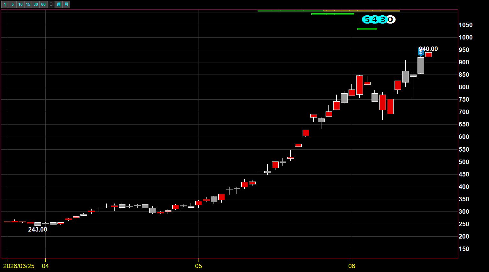
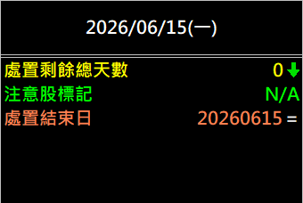
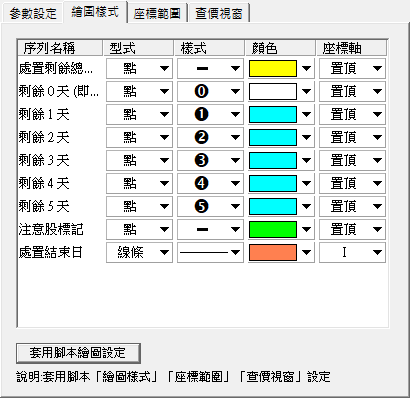

# 處置警示倒數計時器

**台股處置／注意股的「解禁倒數計時器」**

手上的股票被處置了？一眼看出還有幾天解除交易限制——主圖頂端 5→0 倒數，不再錯算日子

 

 

  

[-3DDC84?style=for-the-badge)](https://github.com/mophyfei/MOFI_XQ/raw/main/05.%20%E4%BA%8B%E4%BB%B6%E9%9D%A2%E8%A7%80%E6%B8%AC/%E8%99%95%E7%BD%AE%E8%AD%A6%E7%A4%BA%E5%80%92%E6%95%B8%E8%A8%88%E6%99%82%E5%99%A8/05.%20%E4%BA%8B%E4%BB%B6%E9%9D%A2%20-%20%E8%99%95%E7%BD%AE%E8%AD%A6%E7%A4%BA%E5%80%92%E6%95%B8%E8%A8%88%E6%99%82%E5%99%A8%20%28%E8%80%81%E5%A2%A8%E5%84%AA%E6%83%A0%E7%A2%BC%EF%BC%9A%40MOFI%29.xsb)
&nbsp;

### 🔑 使用前必做：先綁定優惠碼 `@MOFI`

**本腳本需在 XQ 綁定優惠碼 `@MOFI` 才能解鎖使用**；綁定 `@MOFI` 為 XQ 平台官方推薦活動，可獲 XQ 點數 100 點折抵 👇

📣 **利益揭露**：綁定 `@MOFI` 為 XQ 平台官方推薦活動；老墨將因您綁定取得平台回饋（屬商業合作關係）。

> ⚠️ **使用前必讀**：本工具為**中性資訊呈現工具**，僅將交易所公告之**處置／注意股**狀態與日期視覺化，**不提供任何個股買賣建議、不對個股做評價**。老墨**非**經主管機關核准之證券投資顧問事業，本內容不構成投資推介。投資決策與盈虧由使用者自行負責。

---

## 💡 這是什麼

> **解決的問題：處置股還剩幾天能動。**

台股若交易過熱或異常，會被交易所列為**注意股**，更嚴重則進入**處置股**（採人工管制撮合、預收款券等限制），且處置有固定的起訖日期。問題是——**你很難記得每一檔的處置到底哪天解除**。

**處置警示倒數計時器** 自動讀取交易所的「處置開始／結束日期」與「注意股」狀態，在 K 線主圖頂端用**倒數數字（❺❹❸❷❶⓪）**標出「距離解除處置還剩幾天」，並在數值欄列出處置結束日。

一眼掌握**何時解禁**，不必再翻公告對日子。

---

## 🪜 怎麼用

1. **匯入指標** — 用 [🚀 一鍵匯入工具](https://github.com/mophyfei/MOFI_XQ/releases/latest/download/XQ-Script-Importer.exe) 匯入，或手動匯入後按 <kbd>F6</kbd> 編譯。
2. **加到技術分析圖** — **加入指標** → 套用到個股 K 線圖（建議**日線**）。匯入時已帶建議樣式，**開箱即用**。
3. **看倒數** — 若該股正處於處置期間，主圖頂端會出現倒數數字（剩 5 天→4→3…→0 即將解禁），數值欄同步顯示「處置剩餘總天數」與「處置結束日」。

> 💡 本指標需套用在**個股**上（大盤無處置狀態）。

---

## 📊 數值欄說明

| 數值 | 意思 |
|------|------|
| **處置剩餘總天數** | 距離解除處置還有幾天（**0 = 當日解禁**） |
| **注意股標記** | 是否為注意股（`N/A` = 非注意股） |
| **處置結束日** | 處置期間的最後一天（格式 YYYYMMDD） |

> 📌 圖例以處置中個股示範，**僅呈現交易所公告之客觀狀態，非個股推介或評價**；圖中線型僅為功能示範，與標的表現無涉。

---

## 🎨 建議繪圖樣式

匯入時已自帶建議樣式（開箱即用）；若需手動調整，於 XQ 指標屬性 → **繪圖樣式** 依下圖設定（皆設「置頂」顯示於主圖上方）：

| 序列 | 型式 | 樣式 | 顏色 |
|------|------|------|------|
| 處置剩餘總天數 | 點 | — | 黃 |
| 剩餘 0 天（即將解禁） | 點 | ⓪ | 白 |
| 剩餘 1～5 天 | 點 | ❶～❺ | 青 |
| 注意股標記 | 點 | — | 綠 |
| 處置結束日 | 綠條 | — | 橘 |

---

## 🧩 需要的 XQ 模組

本腳本為**自訂 XScript 指標**，需訂閱含「自訂指標」功能的模組：

| 模組 | 解鎖 | 本腳本 |
|------|------|:---:|
| **盤中量化交易模組** $1,000/月 | 自訂指標／XScript、策略雷達、警示、回溯、自動交易 | ✅ 必要 |

> 💡 自訂指標屬「盤中量化交易模組」。手機僅限監控訊號，完整功能需電腦版。不確定方案？看 [XQ 模組比較](https://www.xq.com.tw/module-compare/)。

---

## ⚠️ 注意事項與免責聲明

- 🔑 需在 XQ 綁定優惠碼 **`@MOFI`** 才能解鎖使用
- 📣 **利益揭露**：綁定 `@MOFI` 為 XQ 平台官方推薦活動；老墨將因您綁定取得平台回饋（屬商業合作關係）
- 資料來源為交易所公告之處置／注意股狀態，**僅供資訊參考**；實際交易限制與日期以交易所公告為準
- 本工具為**中性資訊呈現工具**，不構成買賣建議、不對個股評價；老墨**非**經主管機關核准之證券投資顧問事業
- 所有腳本僅供技術研究與教學用途；投資決策與盈虧由使用者自行負責

---

[← 回到腳本庫首頁](../../README.md) ·  老墨 XQ 腳本庫 · 解鎖優惠碼 `@MOFI`

