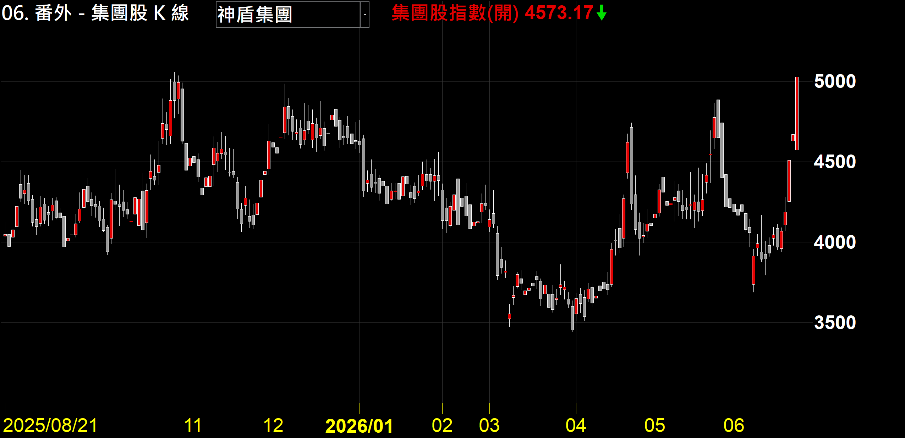
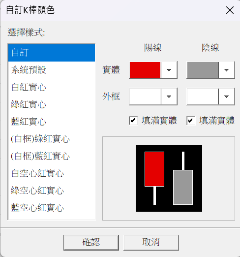
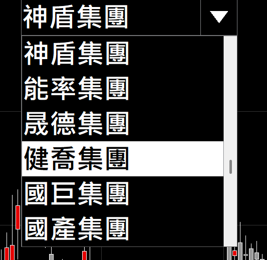

# 集團股 K 線

**想看一整個集團是漲是跌，不用自己把成分股一檔一檔疊**

下拉選一個台股集團，自動把成分股用市值加權合成一條 K 線

 

 

  

[-3DDC84?style=for-the-badge)](https://github.com/mophyfei/MOFI_XQ/raw/main/06.%20%E7%95%AA%E5%A4%96%EF%BC%8E%E5%85%B6%E4%BB%96%E8%A7%80%E6%B8%AC/%E9%9B%86%E5%9C%98%E8%82%A1%20K%20%E7%B7%9A/%E9%9B%86%E5%9C%98%E8%82%A1%20K%20%E7%B7%9A%20%28%E8%80%81%E5%A2%A8%E5%84%AA%E6%83%A0%E7%A2%BC%EF%BC%9A%40MOFI%29.xsb)
&nbsp;

### 🔑 使用前必做：先綁定優惠碼 `@MOFI`

**本腳本需在 XQ 綁定優惠碼 `@MOFI` 才能解鎖使用**；綁定 `@MOFI` 為 XQ 平台官方推薦活動，可獲 XQ 點數 100 點折抵 👇

📣 **利益揭露**：綁定 `@MOFI` 為 XQ 平台官方推薦活動；老墨將因您綁定取得平台回饋（屬商業合作關係）。

> ⚠️ **使用前必讀**：本工具為**中性技術分析輔助工具**，僅呈現客觀數據，**不提供任何個股買賣建議、不保證獲利**。老墨**非**經主管機關核准之證券投資顧問事業，本內容不構成投資推介。**歷史數據不代表未來表現**，投資決策與盈虧由使用者自行負責。

---

## 💡 這是什麼

**解決的問題：想一眼看「台塑／聯電／台積電…一整個集團」現在是漲是跌，不用自己把成分股一檔一檔疊起來。**

XQ 有「集團股清單」可以看，但那是一張表、看的是個股漲跌，**看不出這個集團「整體」的走勢線**。這支指標把你選的集團裡所有成分股，**依各檔市值加權**（大公司影響大、小公司影響小），合成**一條 K 線**——等於幫這個集團做了一個自己的「指數」。

- 內建 **80 個台股集團**下拉直選，選了自動帶入該集團成分股，不用手動輸入代碼
- **市值加權**：用各檔「發行張數 × 股價」當權重，大公司影響大、小公司影響小，貼近集團真實份量分布
- **合成一條走勢 K 線**：把成分股加權後合成單一 K 線，看的是集團「整體」的漲跌形狀，換集團會自動重算
- 涵蓋集團的**上市／上櫃**成分股（興櫃股票的發行張數等基本資料較不完整、做不了市值加權，這版先不納入）

> 用途範例：想知道「**泛鴻海集團整體**這波有沒有跟上大盤」「**富邦集團**最近是不是轉弱」，選一下就有一條集團 K 線可以對照。

---

## 🪜 怎麼用

1. **匯入指標** — 用 [🚀 一鍵匯入工具](https://github.com/mophyfei/MOFI_XQ/releases/latest/download/XQ-Script-Importer.exe) 匯入；或手動：XQ →「**策略**」→ **XScript 編輯器** →「**匯入**」→ 選 `.xsb` 檔 → 按 <kbd>F6</kbd> 編譯。
2. **加到技術分析圖** — 加入指標 → 套用（會以獨立副圖畫出集團 K 線；掛在哪個商品上都行，集團指數與掛載商品無關）。
3. **下拉選集團** — 在指標參數的「**選擇集團**」下拉選一個集團，圖上的 K 線就會換成該集團的市值加權走勢。
4. **（可選）自訂 K 棒顏色** — 在指標的「自訂 K 棒顏色」可調整陽線／陰線配色，配合自己的看盤習慣。

---

## ⚙️ 參數說明

| 參數 | 說明 | 預設值 |
|------|------|--------|
| **選擇集團** | 下拉選 80 個台股集團之一，選定後自動帶入該集團成分股 | 台積電集團 |

> 📌 成分股名單取自 XQ 集團股清單；圖例僅為功能示範，非個股推介或評價。

**📋 支援的 80 個集團（全部內建，下拉直選）**

| 集團 | 集團 | 集團 | 集團 | 集團 |
|------|------|------|------|------|
| 力晶 | 仁寶 | 和信 | 神盾 | 義聯 |
| 力麗 | 日月光 | 和泰 | 能率 | 群光藍天 |
| 三地 | 世紀鋼 | 和碩 | 晟德 | 裕隆 |
| 三商行 | 台塑 | 明基友達 | 健喬 | 榮成 |
| 三陽 | 台達電 | 東元電機 | 國巨 | 遠東 |
| 上曜 | 台聚 | 東洋 | 國產 | 遠雄 |
| 大同 | 台積電 | 泛中信 | 國碩 | 廣達 |
| 大眾 | 台灣鋼鐵 | 泛鴻海 | 統一 | 潤泰 |
| 大億企業 | 正崴 | 炎洲 | 頂新 | 緯創 |
| 中天生技 | 正隆 | 金寶 | 富邦 | 震旦 |
| 中美晶 | 永信 | 長榮 | 華新麗華 | 霖園 |
| 中華電信 | 永豐餘 | 南紡 | 華榮 | 錸德 |
| 中鼎 | 生達 | 威盛 | 華碩 | 聲寶 |
| 中鋼 | 仰德 | 美吾華 | 新光 | 聯發科 |
| 中環 | 光寶 | 耐斯 | 萬海 | 聯華神通 |
| 中纖 | 宏碁 | 凌陽 | 萬華 | 聯電 |

表格省略「集團」二字，下拉實際顯示為「力晶集團」「台積電集團」等全名。

---

## 🧩 需要的 XQ 模組

本腳本為**自訂 XScript 指標**，且用各檔「發行張數」做市值加權（屬盤後基本面資料），需訂閱**兩個模組**：

| 模組 | 解鎖 | 本腳本 |
|------|------|:---:|
| **盤中量化交易模組** $1,000/月 | 自訂指標／XScript、策略雷達、警示、回溯、自動交易 | ✅ 必要 |
| **盤後量化選股模組** $1,000/月 | 財務／基本面／籌碼面等 900＋ 資料欄位（含「發行張數」） | ✅ 必要 |

> 💡 自訂指標需「盤中量化交易模組」；本腳本另用「發行張數」這個盤後基本面欄位做加權，需再加「盤後量化選股模組」，兩者缺一、集團 K 線會畫不出來或失準。手機僅限監控訊號，完整功能需電腦版。[XQ 模組比較](https://www.xq.com.tw/module-compare/)。

---

## 📌 版本紀錄

### v1.1（2026-06-30）
- **移除全部興櫃成分股（40 檔）**：原本各集團裡的興櫃個股（代碼後綴 `.TE`）全數剔除。
- **為什麼**：這支指標是靠各檔的「發行張數」算出市值、再做加權的。但興櫃股票的這類基本資料（發行張數、股本、市值）本來就比較不完整，實測下來抓不到——沒有發行張數，就沒辦法算它在集團裡的市值權重，硬留著反而會讓整條集團 K 線失真。所以這版先把興櫃成分股都拿掉，只留資料完整、能正常做市值加權的上市／上櫃股，算出來的集團走勢才比較準。
- 同步在「需要的 XQ 模組」補上**盤後量化選股模組**（發行張數屬盤後基本面欄位、需此模組才抓得到）。

### v1.0（2026-06-24）
- 首版上架：內建 80 個台股集團下拉直選，依市值加權合成集團 K 線。

---

## ⚠️ 注意事項與免責聲明

- 🔑 需在 XQ 綁定優惠碼 **`@MOFI`** 才能解鎖使用
- 📣 **利益揭露**：綁定 `@MOFI` 為 XQ 平台官方推薦活動；老墨將因您綁定取得平台回饋（屬商業合作關係）
- **僅納入上市／上櫃成分股**：興櫃股票的發行張數等基本資料較不完整、做不了市值加權，這版先不納入；集團若有興櫃成員，指數不反映那部分（占比通常很小）
- 集團成分股名單依 XQ 集團股清單整理，**可能隨成分股調整或新上市／下市而與最新狀況有出入**
- 指數的**絕對數值僅供走勢參考**：成分股上市時間不同，越早期的歷史絕對水準越可能失真，看「近期相對走勢形狀」較有意義
- 本工具為中性技術分析輔助工具，數值皆為客觀／歷史數據，**不代表未來、不構成買賣建議、不保證獲利**
- 老墨**非**經主管機關核准之證券投資顧問事業；本內容不構成投資推介或分析意見
- 所有腳本僅供技術研究與教學用途；投資決策與盈虧由使用者自行負責

---

[← 回到腳本庫首頁](../../README.md) ·  老墨 XQ 腳本庫 · 解鎖優惠碼 `@MOFI`

